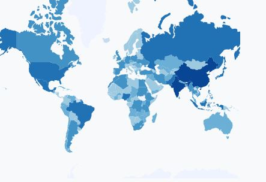
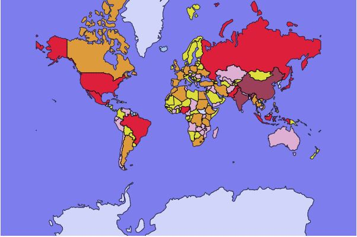
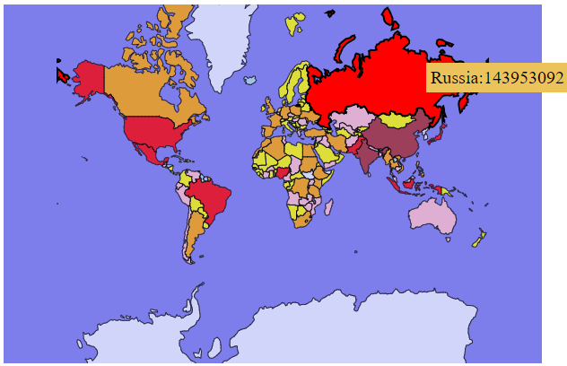
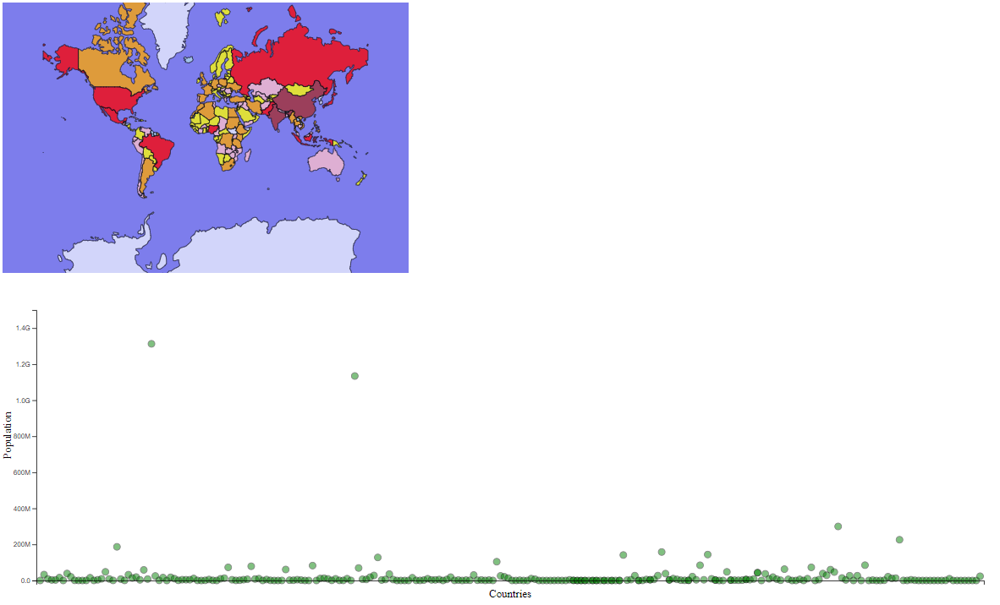
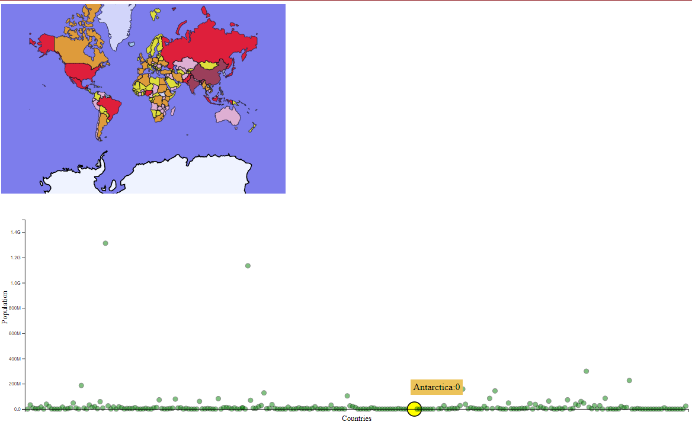

Assignment 4 - DataVis Remix + Multiple Views
===

REMIX
---
Original visualization: 

The original visualization is a world map I found online. It is color-coded with the d3.blueSchemes with 7 different shades of blue to represent population of a country. Higher color shade corresponds to higher population. For example, Dark blue for China and India, very light blue for Antarctic.

Problems with it:
- Bad color scale: Countries with high population are distinguishable from low/medium population, but not distinguishable amongst high population countries. Moreover, intermediate shades of blue are very difficult to percept. Also, differences between colors of same scale are difficult to percept.
- No boundaries around countries: Since the color of Antarctica is very light blue (almost white), it seems that the original map doesn't have it. Same goes for the boundries between other countries, such as India and China.
- No interactive features

Remix visualization: 

This remix version of the above visualization tries to fix the above-mentioned problems. For color scale, I used different hues to depict different population sizes. Brown corresponds to the highest populations, followed by red to depict high populations. Orange, pink, yellow and light blue represent descending population sizes, with very light blue representing a population close to 0. Also, the background is changed to blue color for depicting oceans and seas. I have added strokes for boundaries between countries as well as countries and water bodies. 

The interactions I have added are based on mouseover, mousemove and mouseout events. They are:
- Increased stroke width
- Increased opacity (from original 0.75 to 1)
- A tool tip representing country name and respective population

Interactions on remix visualization: 

LINKED VIEWS
---
For Linked Views, I considered making a view about displaying population data using a scatter plot.

Linked View: 

The x-axis represent countries and the y-axis represent their respective populations. The reason why I chose this visualization idiom is because we have learnt in class that spacial position is more perceptive than hue. So to highlight the difference between population of different countries, the scatter plot utilizes the spacial position (height difference) as opposed to the color scale used by the map visualization.

The two views are linked in the following way:

Link from Map to Scatterplot:

Link from Scatterplot to Map:

Here hovering over a country in map, highlights its respective scatter dot in the scatter plot and increases its opacity and size, and changes its color. Hovering over a scatter dot in the scatterplot highlights the respective country in the map by increasing its opacity and strokewidth.

Thus, the two views are linked to each other.

Technical Achievements
---

Design Achievements
---

Extra Links
---

- https://observablehq.com/@philippkoytek/d3-part-3-brushing-and-linking
- https://bl.ocks.org/john-guerra/raw/2c00b2d675a6bf1c84a7b140f4536b0d/
- https://github.com/d3/d3-brush
- https://observablehq.com/collection/@d3/d3-brush
- https://observablehq.com/@d3/focus-context?collection=@d3/d3-brush

References
---
- https://www.d3-graph-gallery.com/graph/choropleth_basic.html
- https://observablehq.com/@jyotisunkara/linked-bar-chart-and-scatter-plot
