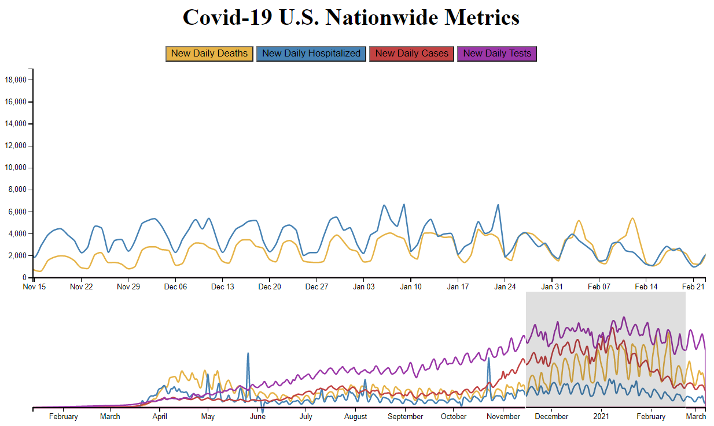
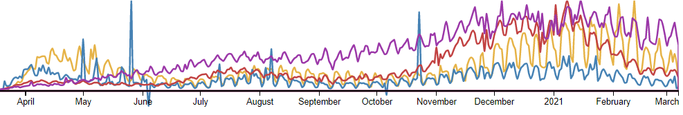
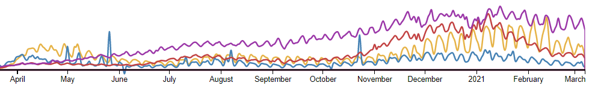

Assignment 4 - DataVis Remix + Multiple Views
===

gitpages: 

Vis critique
---

Original vis - https://www.reddit.com/r/dataisbeautiful/comments/lqhe0h/oc_its_beautiful_to_see_covid19_numbers_heading/

One thing I think this vis does well is showing the correlation between these plots. The colors are also well chosen, hospital blue, virus cases red. Since the scale is different on all four of the graphs it is a bit difficult to get a sense of scale when comparing multiple plots at once. Also this overview of four plots could be condensed. I think it would also be interesting to zoom in on the visualization to look at more specific days and encourage the user to explore a bit more.

Remix
---

The four plots from the original vis have been condensed into one overview at the bottom that not only allows for a quick take on correlation between elements but also has a brush zoom element. This allows the user to select an area on the vis below and the timeline will expand for a closer look at a specific month or days. Four buttons under the title rescale the vis, allowing the user to focus on a particular variable.

Having all the elements on the same plot does portray the sense of scale quite well, as it really puts into perspective how large the numbers actually are. Unfortunately, since the scale covers such a large range, it is difficult to frame two variables when one range is less than one percent of the others (Daily Test vs Daily Hospitalized). In this sense I am glad to have the bottom view handle the larger overview.

Achievements 
---

- Design

Since the scale difference between these charts where super large, I wanted to add some zooming element to better sell the sense of scale. This was done by rescaling and animating the yAxis as well as animating the lines.

Since the data is also very “wavy”  (technical term), I looked into some different curves to use for the overview since the exact numbers were less relevant here, and found a smoother shape that really cleared up the view.

Monotone Curve

Bundle Curve

- Tech

none this time around.
