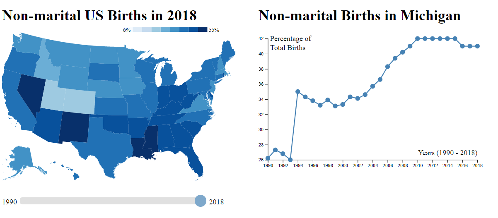
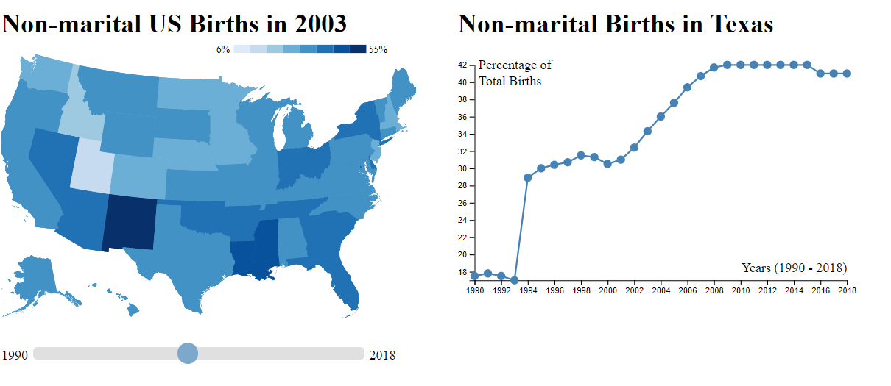
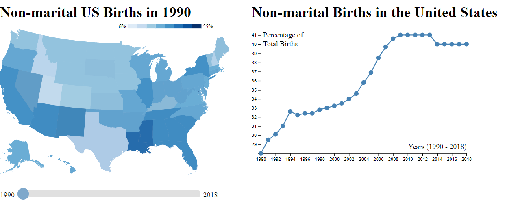

Assignment 4 - DataVis Remix + Multiple Views
===

[Check out the full remixed visualization here](https://cscholler.github.io/04-Remix/)

For this assignment I remixed a visualization I found on r/dataisbeautiful.
The original visualization showed the percent of nonmarital births in the US. 
This visualization had a few glaring issues.
The first of these issues was that it was unclear what year or timeframe the data was from.
The second issue was that the bin sized used for the chart seemed quite arbitrary and did not offer much detail into individual states.

Inorder to counter these issues my visualisation allows for interactivity between the years and states.
At the top of each chart you can clearly see the data/state that is being demonstrated.
Tool tips are also present that show the exact value of each selected data point. 
I also changed the bin size to be 6% inorder to better illustrate the difference between states.
Finally, I added a second chart that shows the change in non-marital birthrate over the years by state.

Description of Visualisation
---
This visualisation includes two linked charts, one choropleth and one scatter plot.
The choropleth shows the non-marital birthrate for a given year defaulting at 2018.
Below the title of the choropleth is a legend that shows the range that each of the colors in the choropleth are associated with.
Below the choropleth is a slider ranging from the year 1990 to 2018.
Sliding this slider updates the title of the choropleth, and the data visualised of the choropleth. 
Mousing over a state will update the scatter plot on the right of the choropleth, which defaults to showing nationwide data, and show a tool tip
which shows the percent of non-marital births for that state, in that year, and the states name.

Once a state is moused over the connected scatter plot on the right shows the non-marital births for that state between 1990 and 2018.
The x and y-axis will update to match the given state best.
Mousing over individual data here will show another tool tip showing the exact percentage of non-marital births in that state for that year.

The data for this visualisation was found [here](https://datacenter.kidscount.org/data/tables/7-births-to-unmarried-women?loc=1&loct=1#detailed/2/2-53/false/37,871,870,573,869,36,868,867,133,38/any/257,258).

Technical Achievements
---
For this assignment I implemented quite a few techniques.
The first of these was the use of a choropleth to demonstrate the data across the nation.
Using a choropleth allowed me to show all state data for a year at once while a connected scatter plot allowed me to show the data of one state over all years at once.
Another technical achievement was having linked visualisations using the mouseover and mouseleave commands.
Using these I was able to update the connected scatter plot as each state was moused over.
In order to implement the connected scatter plot I had to use a d3 path, which was something I had not encountered before.
I also used a slider to change the year being illustrated by the choropleth
Finally, to show both charts side by side I had to use two divs on one page, which was also something I had never done before. 

Design Achievements
---
For this visualisation I used a blue color scheme based on the d3 blues scheme.
The individual state ranges are colored based on this scheme, while the year slider and scatter plot use a similar tone of blue.
In order to make the data easier to read and understand the titles of the charts update based on what data you are looking at.
The choropleth includes a labeled key inorder to show the corresponding range of the shown colors. 
Using the labeled slider below the choropleth updates its title and the chart with the corresponding year and data.
Mousing over a state not only shows a tool tip of the current state's name and non-marital birthrate for that year but it also updates the connected scatter plot.
When the scatter plot updates its title is changed to the corresponding state, and axis range change to best scale the state's data.
The scatter plot also shows tool tips when dots are moused over to show the year and exact percent for that year.

