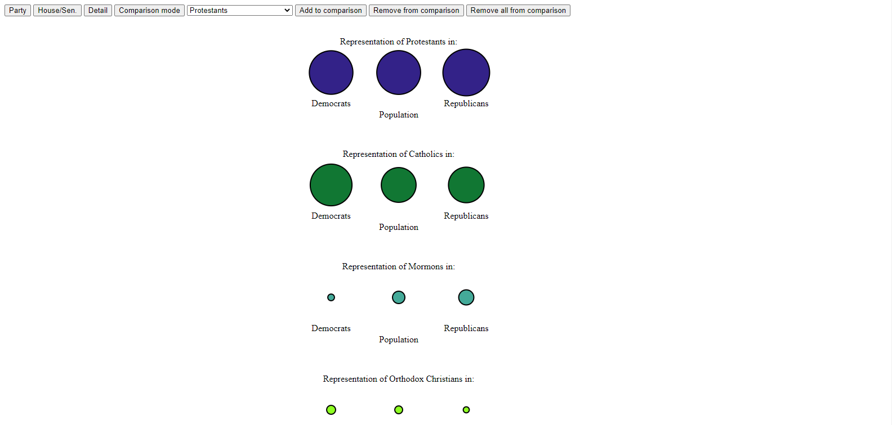
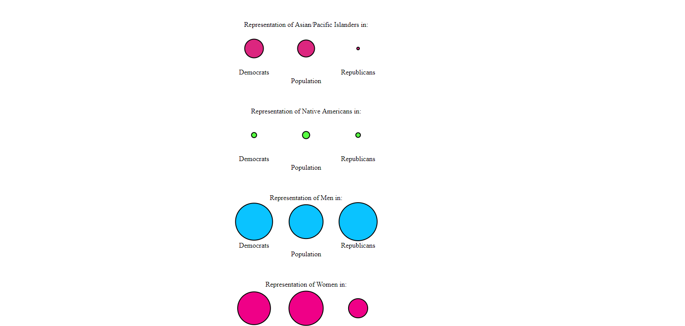
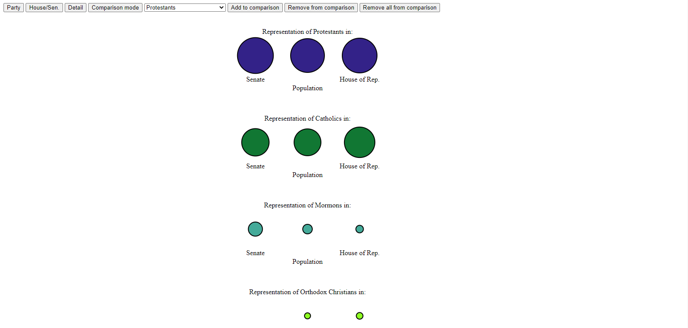
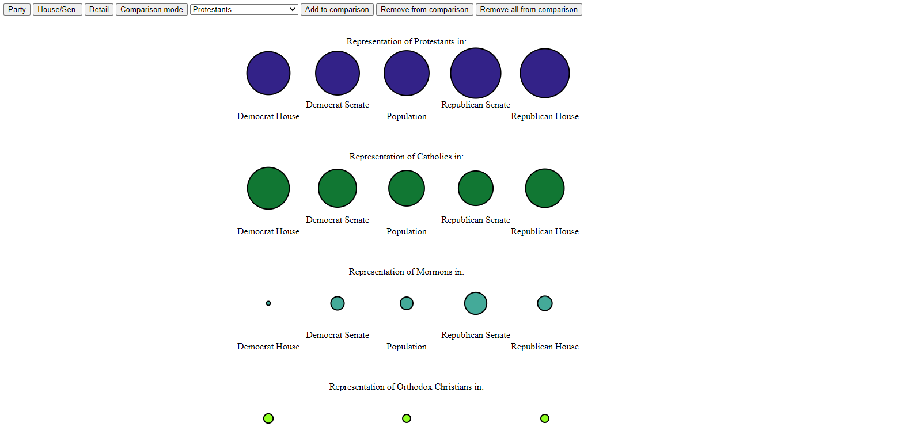
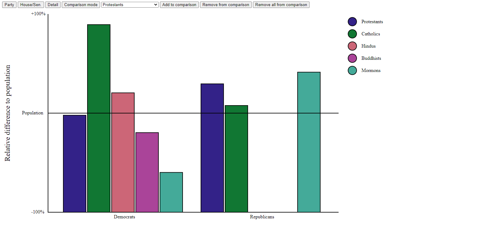
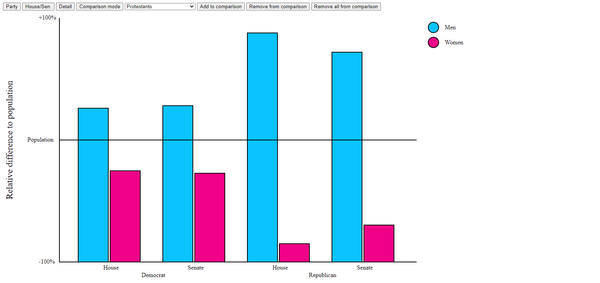

# 04-Remix

Assignment 4 - DataVis Remix + Multiple Views
===

### Original Vis: 
https://www.reddit.com/r/dataisbeautiful/comments/iho046/how_representative_are_the_representatives_the/

### Data sources:
https://www.pewforum.org/2019/01/03/faith-on-the-hill-116/
https://www.pewforum.org/wp-content/uploads/sites/7/2019/11/Detailed-tables-for-upload-11.11.19.pdf
https://fas.org/sgp/crs/misc/R45583.pdf
https://www.census.gov/quickfacts/fact/table/US/PST045219#qf-headnote-b

## Overview
I chose this vis because I found it interesting, and because I know that pie charts are generally frowned upon. One problem I had with the original vis was that while it was easy enough to compare values within each pie chart, comparing values across charts wasn't as intuitive, so I wanted to find a better way to do that.

For the first view of my vis, I decided to have a simple set of circles, whos area represented the varios demographics, categorized by party.

I also expanded on the original vis by adding options for viewing distribution in the House of Representatives and Senate, as well as a more detailed view for the House and Senate by party.

For the second view of my vis, I wanted a slightly less abstract view, as well as a bit more interactivity. As such, I decided on a bar graph, that scaled the values as relative to the population. The point of the original vis was to show how the population was represented in congress, so I figured that this was the best way to do that.

Using the controls along the top of the page, the user can add and remove demographics to/from the vis. The second view also retains the option to seperate data by house/senate.

### Github Pages Link:
https://fish-hat.github.io/04-Remix/

## Achievements:
### Tech
Comparison mode automatically scales the width of bars on the graph to fit. The page remembers the settings input by the user, including what groups were selected for comparison mode, even across refreshes.

### Design
Made the bubbles for the initial vis scale logarithmically, to better highlight proportional differences over absolute differences. Similarly, the comparison mode view scales bars as relative to the population