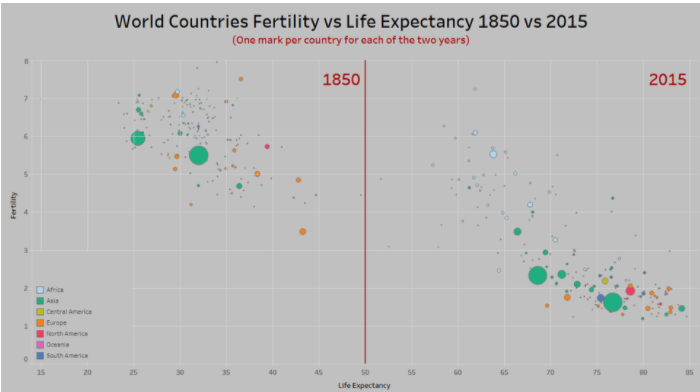
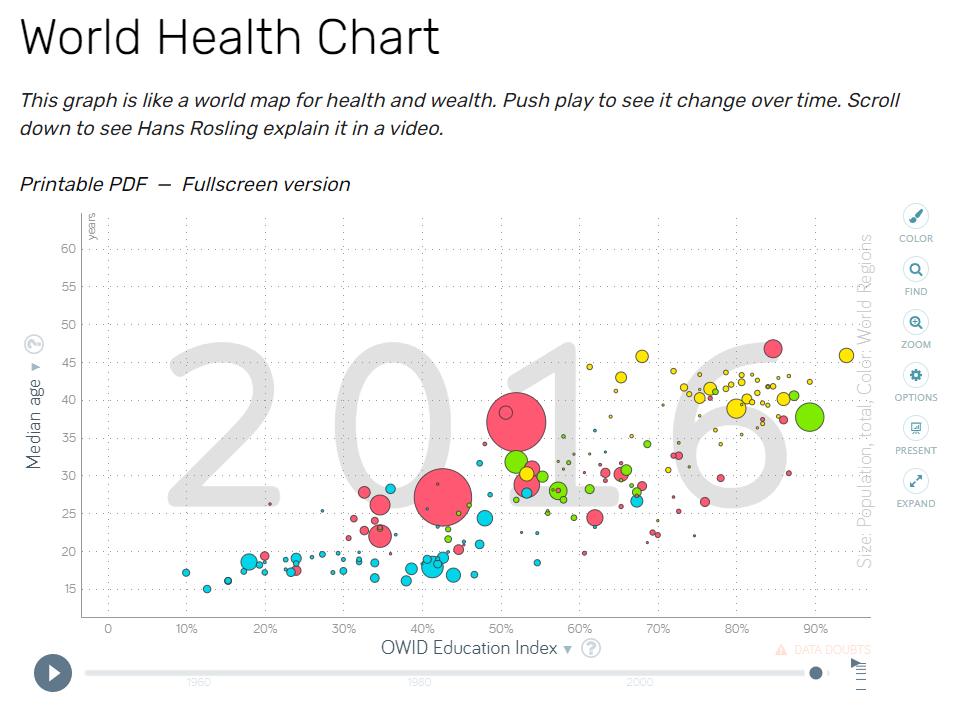
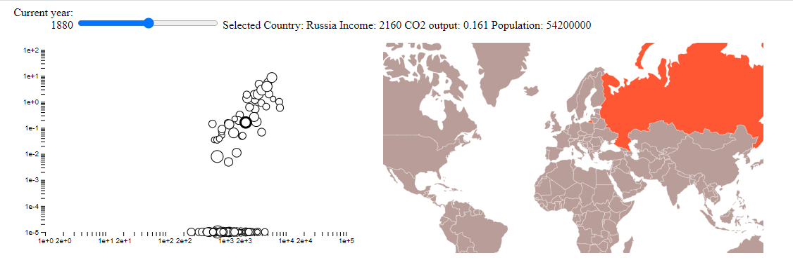
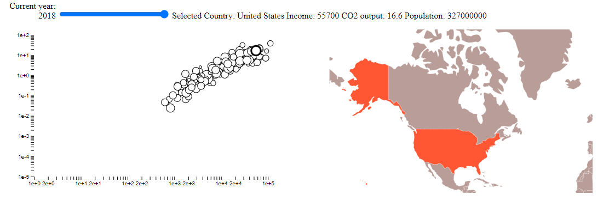

# Assignment 4 - DataVis Remix + Multiple Views
===

### Original Vis and Critique

Original Vis, Uncovered on r/dataisbeautiful subreddit

(Post linked [Here](https://www.reddit.com/r/dataisbeautiful/comments/lz8t2i/fertility_vs_life_expectancy_1850_vs_2015_oc_see/))

This original vis has a very specific use case in my opinion. It is meant to show the person looking at the picture that since 1850, there have been dramatic increases in life expectancy and birth rates accross the entire world. My first thought was that I could do a lot more with the data that was linked in the description. Thing is, it was already done on the site where the data was stored! There was a much more professional looking vis that I will be remixing, pictured below

(Link [Here](https://www.gapminder.org/fw/world-health-chart/))

To make this a viable project for myself, I could not do every data dimension on every axis, for data manipulation choices alone. The primary improvement I could notice in this geographical aspects of the data were being lost. There is a color that shows what region a country is from, but this doesn't really encode its position in the world. 

#### Use Case For Remix

When a user is utilizing a two axis scatter that changes over time, they may want to explore a tight geographical region. The vis on this website did have a search feature, but then you have to search one at a time and they are organized by name. I found myself intrigued by the life expectancy dip during WWI in many countries, I would love to zoom in on Europe and see how the life expectancies changes geographically year over year, but this isn't possible in the current vis  

Therefore, I am choosing to add a geographical component to give the data additional context and allow for a new method of exploration. 
Geographical context was a major drawback to this first vis. 

## Finished Product

(Link [Here]())
This has been the most interesting project I've worked on, for some insane reason I built the entire scatter plot and scrolling feature myself because I couldn't find anything on the internet I liked.

So the two dimensions from the original vis I chose to take were income (x-axis) and co2 output (y-axis). There is also a time axis, and the way to navigate the data that way is using a slider. For example, going back in time shows...

This picture also shows the highlighting/data linking feature that is required for this assignment. If you mouse over a country on the right, if there is a data point in the datset, it will increaser the stroke width that point to bring focus to it, bring the datapoint to the front, and populate the statistics at the top of the page. If you mouse over a data point, it will highlight the corresponding country and populate the statistics at the top of the page.

The map vis also has pan and zoom, and is code taken/derived from our in class example by prof Harrison

### Detailed Work / Tech and Design Achievements

How I linked the two vis: 
The data points and countries are both based off of CSV tables. Each CSV table was formatted to use the alpha3 country codes. When making the data points, I gave each circle an id in the format of "scatter{___}" for the scatter point for USA and when drawing the paths I gave a corresponding id of "map{___}" (alpha 3 codes replace {___}). This way each element could select the other in the mouseover functions only needing to know its own alpha3 code and then prepending "map" or "scatter". So that is exactly what I did in the mouseover and mouseout functions of both of them

Credits to sources:
https://www.d3-graph-gallery.com/graph/scatter_basic.html
(also prof harrisons lecture notes)

**Design achievements**
 - Simple color scheme and design that is intuitive and not overcomplicated (original vis colored points by continent)
 - Used log scales to cover large ranges of data in both the income, CO2, and population data
 - Colorblind friendly (only uses saturation and luminance scales)

**Tech Achievements**
 - Implemented graph by hand (excluding the code for the slider)
    - Graph components csv's can be swapped out if you want different data comparisons
 - Selecting a datapoint will bring it to the front of a users vision, making it easier to use
 - The map is pannable and zoomable
 - The slider that controls the year for the currently selected year was a technical challenge as well, I enjoyed designing my vis around it
 - Cleaned co2 and income data CSV's and added alpha3 country ID's to allow selection accross components

