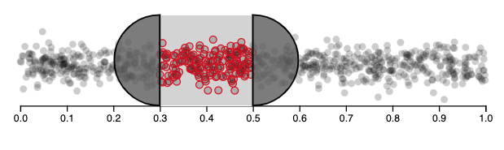
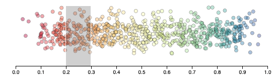
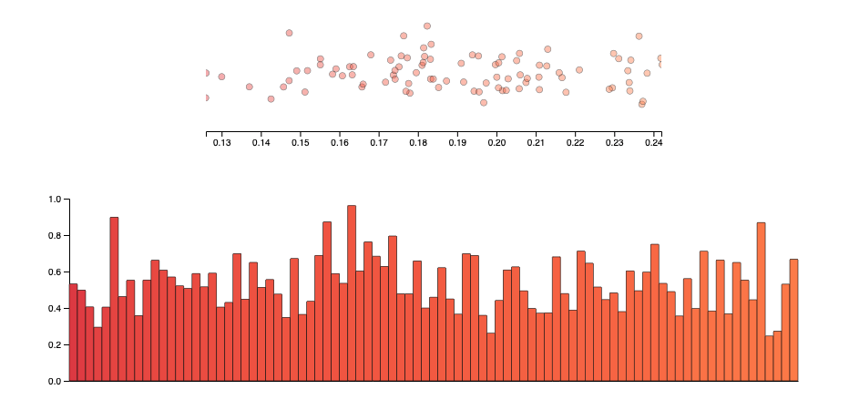

Assignment 4 - DataVis Remix + Multiple Views
===

https://mollywirtz.github.io/04-Remix/index.html

Remix
---
For my remixed vis, I chose to use "Brush Handles" from ObservableHQ [1]. Although this tutorial focused on the implementation of the handles, I chose to take the brush functionality and improve it. I noticed immediately that the brush did not do enough to show the highlighted data in such a noisy data set, and that it was a bit unexciting to look at.

To remix the above above visualization, I did several things. First, I added color to better visualize the x-scale. Next, I removed the handles for a cleaner looking vis. Finally, I fixed what I thought was the primary drawback of this visualization: the inability to closly examine the dense data. When you double-click on the brush, the x-axis now expands to width of the entire graph, and with it, the contained data. This allows the user to zoom in on the brushed data.

Multiple View
---
For the linked view I chose to use a bar graph to better visualize the y-values of the brushed data. On the double-click of the brushed data, the second view updates to show that selected data in bar form. The added y-axis in combination with the bars make visualizing the y-values easier, while the color scale continues to indicate the x-value of each data point. 

Achievements
---
### Design
- Used d3-scale-chromatic library to implement a  rainbow scale, creating a more interesting data set for the user to interact with
- Used 'Poppins' and 'Open Sans' fonts from Google fonts

### Techinical
- Created a HTML + CSS page to display README text, along with the original visualization, the remixed visualization, and the linked view visualization
- Sort and order the data of the bar chart by rgb value

Resources
---
[1] https://observablehq.com/@d3/brush-handles  
[2] https://www.d3-graph-gallery.com/graph/interactivity_brush.html

