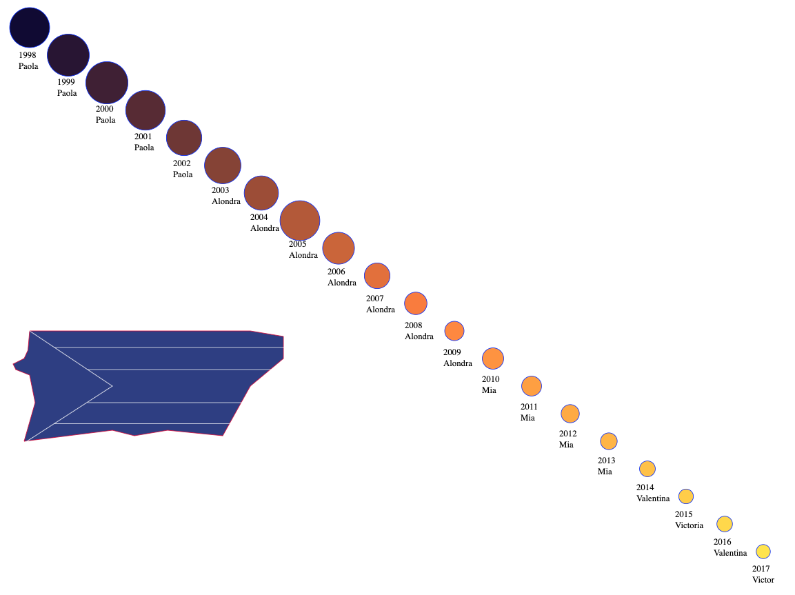
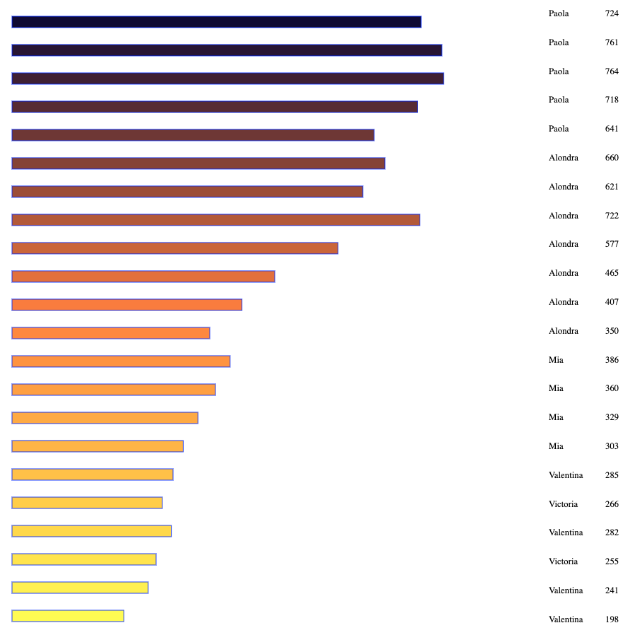

Assignment 4 - DataVis Remix + Multiple Views
===
I WILL BE USING THE EXTRA TIME FOR THIS ASSIGMENT 

Link to project: https://a4-remix.glitch.me/

## Original Design 
For the first assigment, I used (https://www.ssa.gov/oact/babynames/limits.html) data to visualize the most popular names in Puerto Rico. As you can see below, I used circle area to visualize the number of occurances that the most popular name had each year. 

It is artistically interesting to see. However it does come with many limitations. There is no reference as to what the area of the circle actually means and the colors provide no meaning (even though it might appear that they do mean something). The horizontal bar graph does not have an x or a y axis. In addition, the horizontal bar graph and the circle area visualization don't correlate perfectly, so it is confusing as to what each one represents. 

## New Visualization

For the new visualization I wanted to re-do many things. First, I wanted to visualize the most popular names in the 50 states to allow for national exploration of the data. To do this, I created a map that was color coded based on the number of occurances the most popular name in the state had. The colors were hand picked and to show color saturation to make it easier for the user to correlate the number of occurances with the color. The legend on the side shows what each color means. 

Then, instead of just showing a horizontal bar graph, I decided to show a vertical bar graph with x and y axis. The axis stay the same to make it easier to see just how different every state is from each other. The y axis would be the number of occurances each name had and the x axis is the year. Therefore, if you wanted to see how the popular name changes throughout time, you could use the bar graph, and if you wanted to see how each name/number of occurances compares accross the country in a given year, you could also do that. The user would just click on each of the graphs to get the information that they want. 

I filtered the data (using Python) to make sure that only the most popular names were read. I also had to create a dictionary that would interpret NY as New York (for the GeoJson). 

Resources used: https://blog.risingstack.com/d3-js-tutorial-bar-charts-with-javascript/ and http://bl.ocks.org/michellechandra/0b2ce4923dc9b5809922

