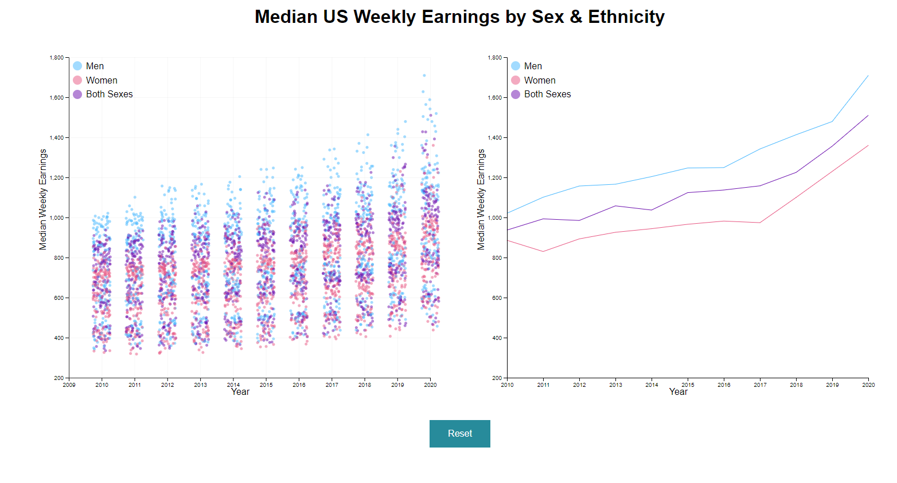
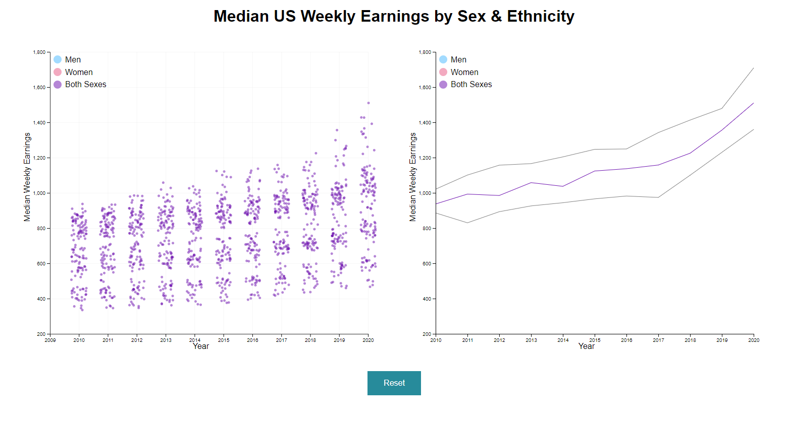
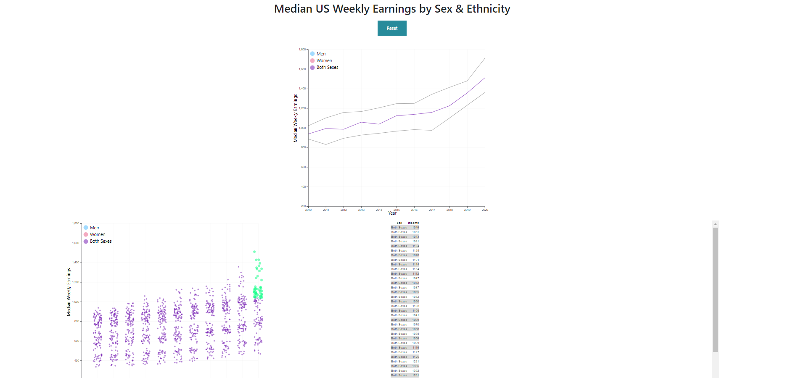
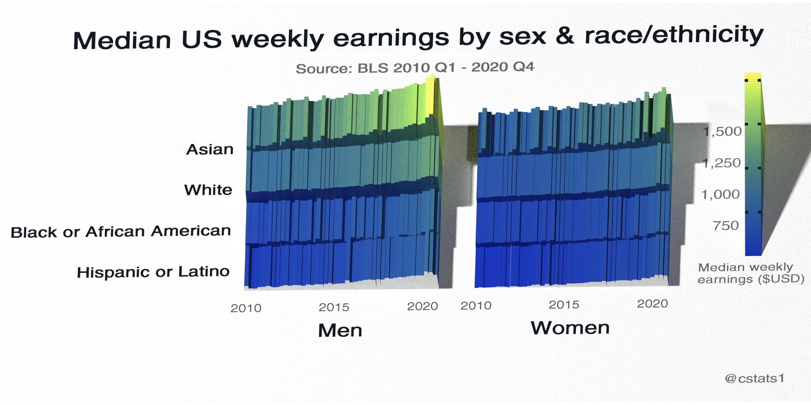

Assignment 4 - DataVis Remix + Multiple Views - Roman Wicky van Doyer
===

Link
---
https://romanwicky.github.io/04-Remix/index.html

Description
---
For this project, I found an original VIS on r/dataisbeautiful that shows the average median income (by week) in the United States by Sex and Ethnicity.
For my remix, I decided to create an interactive linked-vis with a scatter plot, and multi-line graph in D3.
The legend is the interactivity part of the vis, where selecting a sex (Men, Women, Both Sexes) in either graphs
hides all other data points not of that type.

Screenshots
---

Selecting one value on legend updates the focus on the other graph
---

Original Vis Critique
---

Design Achievements
---

Technical Achievements
---

Sources
---

- https://github.com/berthubert/bnt162b2
- https://www.reddit.com/r/dataisbeautiful/comments/luz3es/median_us_weekly_earnings_by_sex_raceethnicity/
- https://www.reddit.com/r/dataisbeautiful/comments/luz3es/median_us_weekly_earnings_by_sex_raceethnicity/gp9ignx/

