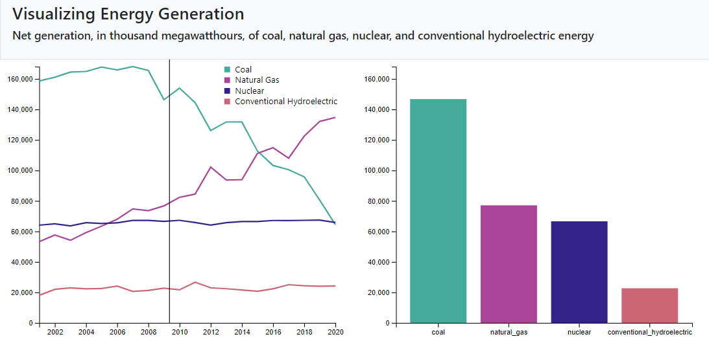

# Assignment 4 - DataVis Remix + Multiple Views

[Visualization Hosted on GitHub Pages](https://jalovering.github.io/04-Remix/)

# Visualization Description
This project was a remix on a [visualization hosted by the U.S. Energy Information Administration](https://www.eia.gov/electricity/data/browser/#/topic/0?agg=2,0,1&fuel=vvg&geo=g&sec=g&linechart=ELEC.GEN.ALL-US-99.M~ELEC.GEN.COW-US-99.M~ELEC.GEN.NG-US-99.M~ELEC.GEN.NUC-US-99.M~ELEC.GEN.HYC-US-99.M&columnchart=ELEC.GEN.ALL-US-99.M~ELEC.GEN.COW-US-99.M~ELEC.GEN.NG-US-99.M~ELEC.GEN.NUC-US-99.M~ELEC.GEN.HYC-US-99.M&map=ELEC.GEN.ALL-US-99.M&freq=M&start=200101&end=202012&chartindexed=0&ctype=linechart&ltype=pin&rtype=s&maptype=0&rse=0&pin=).

The original visualization displays the net generation, in thousand megawatthours, of coal, natural gas, nuclear, and conventional hydroelectric energy. This is a very well made visualization, including tooltips, customizable range, as well as a linked table of individual values. I created a new version of this vis with the goal to summarize the results by year and clearly show proportional differences between each energy type through a linked barplot. 

The remixed version of this visualization is displayed below:
#

# Referenced Code
[Reference on d3.bisector()](https://github.com/d3/d3-array) 
[Refrence on building a legend in d3](https://www.d3-graph-gallery.com/graph/custom_legend.html) 
[Reference on building a barplot in d3](https://www.d3-graph-gallery.com/graph/barplot_basic.html) 

# Achievements
## Design Achievements
Due to the lack of textual labeling of the line plot, it was important to make the visualization colorblind friendly. I selected the color scheme from [David Nichols' Colorblind Palette](https://davidmathlogic.com/colorblind). Each of the four colors used are distinctive for true vision, and individuals with protanopia, deuteranopia, or tritanopia.
## Technical Achievements
In order to make the barplot scaling smooth, with a dataset that only had one value per year, I used an interpolator. The d3.interpolateNumber() function generated an interpolator between the start and end dates nearest to the mouseover. This enabled the calculation of an artificial value within the range of the two true y-values available for each energy type.
