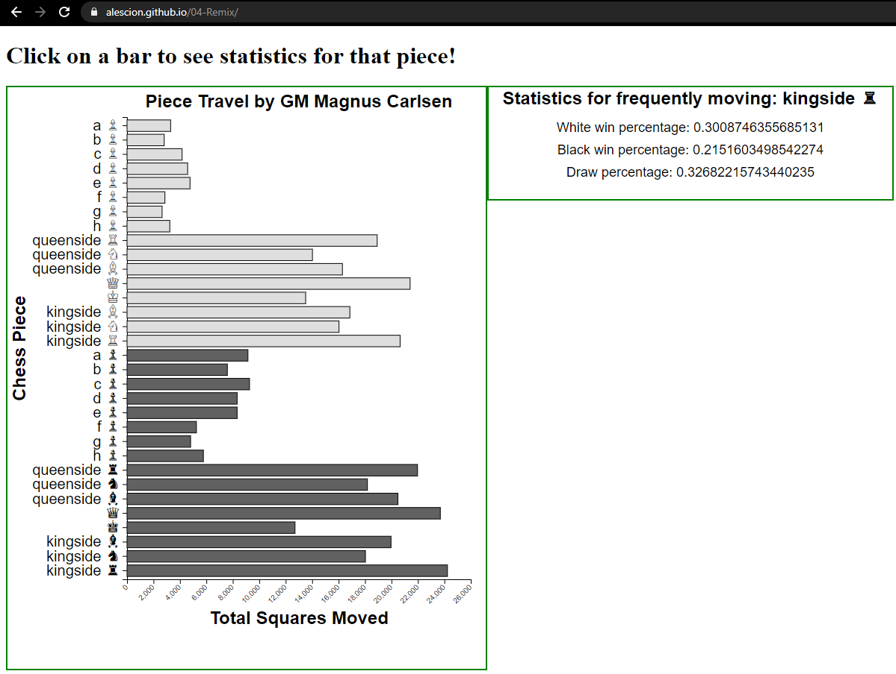

Assignment 4 - DataVis Remix + Multiple Views
===

Netflix Show Ratings History Visualization
---

Screenshot: 

Interactive online version of this visualization located at: https://jmckeen8.github.io/04-Remix/

This is an interactive visualization showing Netflix show content rating data between 2000 and 2020. It is based on this visualization: https://www.reddit.com/r/dataisbeautiful/comments/m2qmio/oc_netflix_has_become_increasingly_adultfocused/ and the data is source from https://www.kaggle.com/shivamb/netflix-shows.

In this visualization, you can click on one of the bars for a year, and a pie chart will show up depicting the same rating percentage breakdown as the stacked bar chart, but more clearly. Then, you can roll your mouse over a particular pie slice to get a more detailed percentage breakdown of the rating sub-categories (R, PG, G, etc.). 

I saw the original version this chart posted to the r/dataisbeautiful subreddit, and quite frankly I wasn't particularly impressed, which is why I wanted to remix it. The OP states that the orginal version was generated simply with Microsoft Excel, which isn't particularly surprising. I was not a fan of the original color scheme (which entirely consisted of shades of blue), nor was I a fan of the fact that there was no way to get a more detaied breakdown of the specific ratings within each category. That being said, I did like the use of the stacked bar chart for the type of data that was being displayed. 

I decided to redo the stacked bar chart with a better color scheme and more clear legend as the remix, then added the secondary visualization (the pie chart with tooltips) for the interactive piece. This allows users to get a better idea of the breakdown within each year which, while pretty easy to see in the stacked bar chart, is even more clear using the secondary visualization. In addition, the secondary visualization interactive tooltips allow the user to explore further detail within the data for each year. The pie chart is also animated, showing smooth animations as the user moves from one year to the next, facilitating even easier comparisons between years as the user can see the pie slices changing size. 

Design Achievements
---
 - Utilizied more varied color scheme more appropriate for cateogorical data. In addition this color scheme was checked specifically to be easily viewable by those with colorblindness

Tech Achievements
---

Resources/Tutorials Consulted
---
 - https://stackoverflow.com/questions/11189284/d3-axis-labeling
 - https://observablehq.com/@stefanreifenberg/basic-stacked-bar-chart-from-the-d3-js-gallery
 - https://www.d3-graph-gallery.com/pie
 - https://bl.ocks.org/mbostock/1346410
 - https://stackoverflow.com/questions/59356095/error-when-transitioning-an-arc-path-attribute-d-expected-arc-flag-0-or = 
 - https://www.webtips.dev/how-to-make-interactive-bubble-charts-in-d3-js (tooltips)
