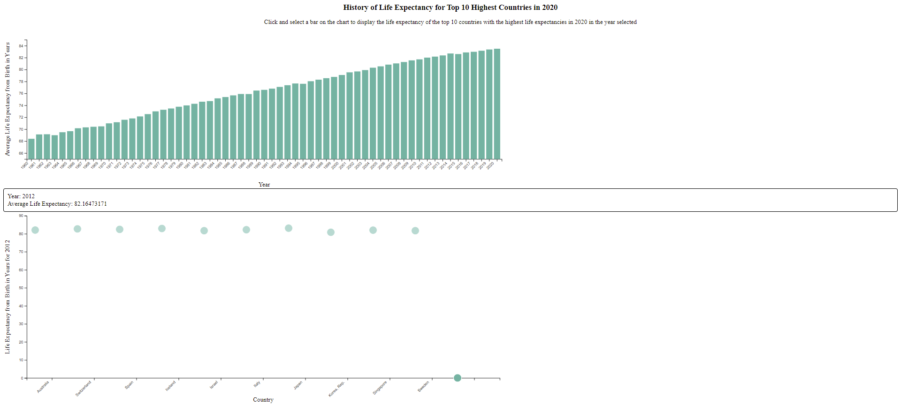

Assignment 4 - DataVis Remix + Multiple Views - Shannon Truong
===

Link to hosted gh-pages
https://truongshan.github.io/04-Remix/

The link to the dataset downloaded online is https://data.worldbank.org/indicator/SP.DYN.LE00.IN

Original inspiration of visualization can be found from: https://www.reddit.com/r/dataisbeautiful/comments/m0i3gy/oc_asian_countries_are_chasing_up_to_european/

In this visualization I decided to remix one of my reflection visualizations. The original visualization that I chose to remix displayed the top 10 countries with the highest life expectancies every year from 1960-2020. The visualization ranked the 10 countries every year in a bar chart style visuaization along with the country name and life expectancydisplayed in the bar chart. For my visualization for the remix, I decided to narrow my data into only focusing on the top 10 countries with the highest life expectancies recorded in 2020. The first visualization is the bar chart which displays the average life expectancy of these 10 countries from the year 1960-2020. The user is able to click on the bar chart to get more detail on the life expectancy of the countries in that specific year which is displayed in the scatter plot in the second view. 

# Technical/Design Achievements

I really enjoyed completing this project because I was able to use what I learned in the previous assignments to culminate into these two different views. Specifically, I was able to use what I learned in assignment 2 and 3 to complete this assignment. 

For technical and design achievements, I was able to include mouse events with the hovering to display more specific data in both visualizations. The details of the points were put in a text container below the visualization. Additionally, one of the more difficult tasks for me to accomplish was passing in selected onclick mouse event data based on the csv into a function. This was accomplished in this project as I was able to produce another more specific visualization and view of the first visualization based on the user selected bar when they clicked on it. In short, when the user selects a bar, the year that corrisponds with the bar is passed into another view to create a visualization to present specific life expectancies for the top 10 countries in that year. I think that my technical and design achievements in this project was pretty effective in allowing for more user interaction and allowing the user to obtain more specific data to undersatnd and process. 

Overall, I thought this remix was really good in showing and understanding the history of life expectancies in the world's current countries with the highest reported life expectancies. I thought it was really interesting, for example, to see that in 1960, the Republic of Korea had a life expectancy of 55 which is pretty low compared to the other countries. Since then, they are now in the top 7 countries with the highest life expectancies which I found to be an interesting fact on their history. This was also seen in some other countries data as well. 
