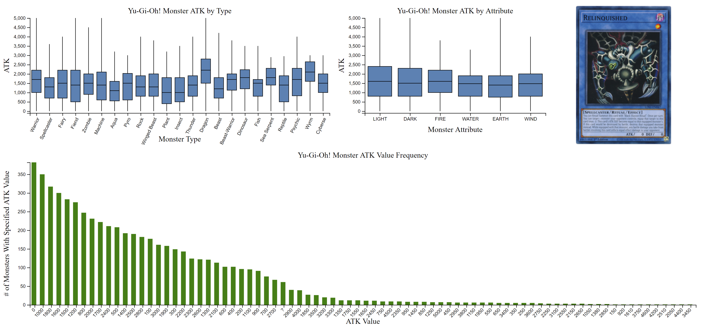
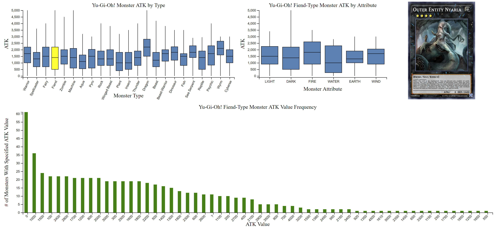
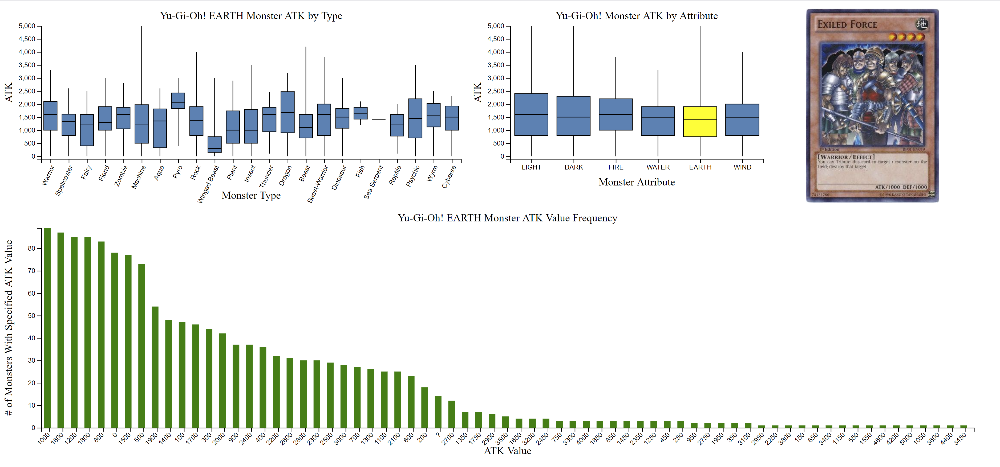

# Description & Improvements Over Original Visualization

In Yu-Gi-Oh!, monster cards have several traits to them- for instance, their Attribute and Type, which determine their elemental affinity and species respectively, as well as their ATK stat, which tells how hard they hit.

The original vis was a long in-depth review of Yu-Gi-Oh! monster stats, which included several boxplots and bar graphs one needed to scroll to access. Among those graphs were boxplots grouping monster ATK by Type and attribute, as well as a bar graph showing the most common monster ATK values. The data used was a CSV file containing the types, attributes, ATK values, and more of every card in the game.

The data provided could go into much more depth, however- I speculated that it was possible to determine the most common monster ATK value by type and attribute, as well as making boxplots of ATK given both type and attribute. The original visualization also had no interactive component whatsoever.

My visualization uses the same data to provide that information through user interaction. You can hover over the "box" of each item in a box plot to focus the visualization. For instance, hovering over the "Dragon" box will make the attribute boxplot show data for only Dragon-Type monsters, and the bar graph will show the most common ATK values for only Dragon-Type monsters.

In addition, the original visualization had no visuals for cards, so I added a picture spot. The card pictured will match the current Type or Attribute selected, and has the ATK value most common to that Type or Attribute, reflected in the bar chart. By default, it shows Relinquished, a monster famous in the anime that just so happens to have the most common monster ATK value.

It's now possible to easily see both the median and mode ATK value per card type and attribute!

The effects of hovering over a box are clearly reflected in the changing titles of each graph.

# Screenshots

When the user isn't hovering over a box, the visualization looks like this:

Hovering over a box in the monster type graph (in this example, Fiend) changes the visualization to this:

Hovering over a box in the monster attribute graph (in this example, EARTH) changes the visualization to this:

# Technical Achievements

This remix uses not only two but FOUR seperate svgs, two of which interact with each other and ALL of which change based on user interaction with a different vis. 

The CSV file used is also utterly massive, to the point where testing using individual values was not possible.

Box and whisker charts cannot be easily built using default d3 plugins- they proved to be much more finnicky than the scatter and bar charts I was used to.

The filtering mechanism to include only the selected type/attribute in each chart was done entirely by me, using a fairly hacky solution to hide invalid results.

# Design Achievements

The axes for each chart are not only clearly labelled, but also change dynamically with the user's interaction so they're never confused.

I also found visual accompaniments to the changing graphs in the form of the image on the side, both to give the user something interesting to look at an a representation of what the results are showing them. The visual shares the selected Type/Attribute as well as the most common ATK value shown in the bottommost graph.

The entire vis also fits nicely on my (albeit very high resolution) screen, without the need to scroll anywhere to see my results change a part of the vis.

# Sources

Boxplot code was adapted from https://www.d3-graph-gallery.com/graph/boxplot_several_groups.html.
Bar chart code was adapted from https://www.d3-graph-gallery.com/graph/barplot_basic.html.
Image placement code was adapted from https://www.fabiofranchino.com/blog/how-to-load-image-in-svg-with-d3js/.
Pictures were taken from https://yugioh.fandom.com/wiki/.