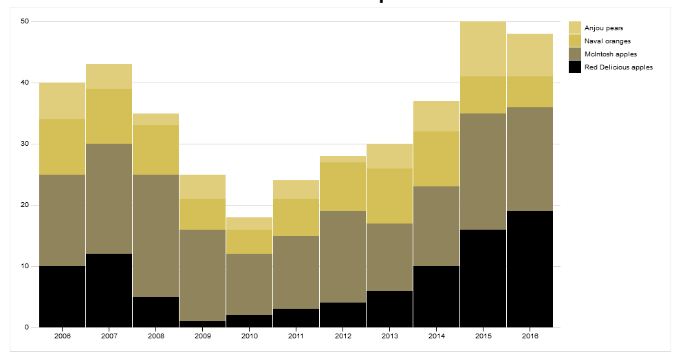
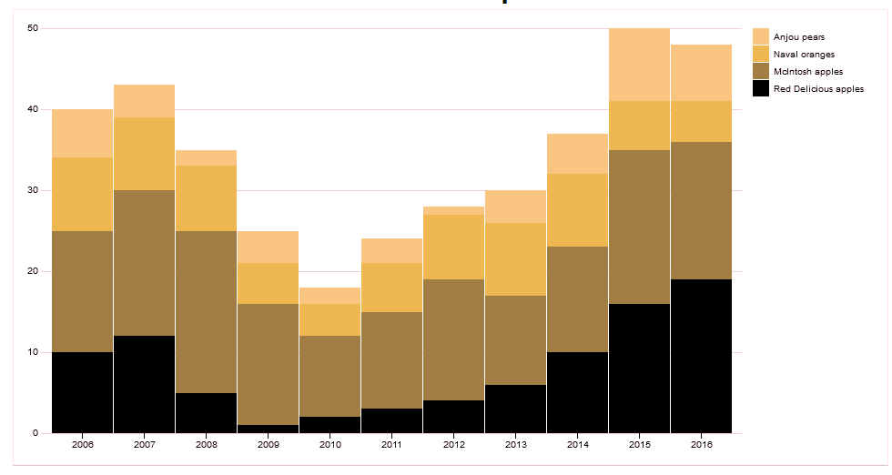
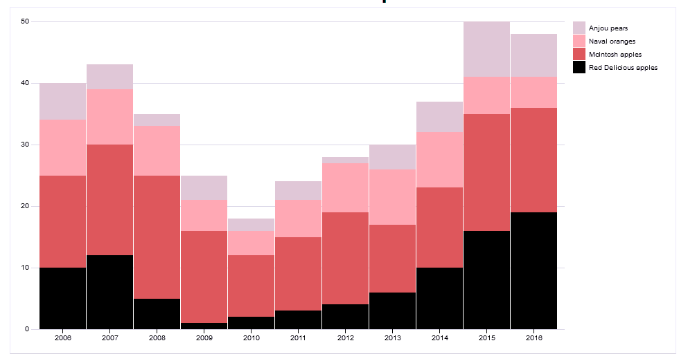
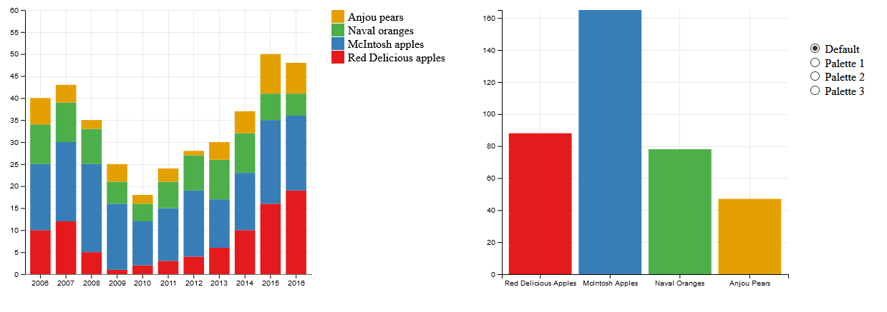
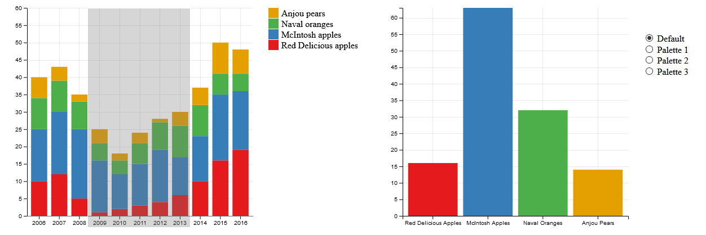
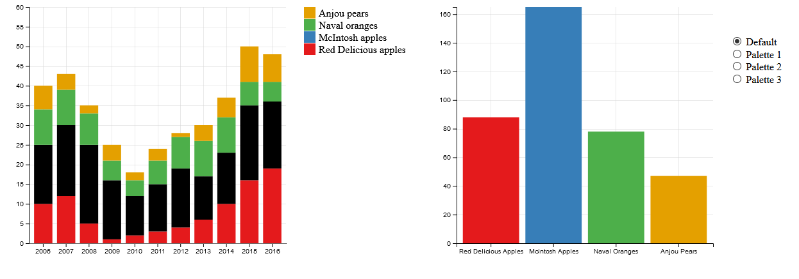
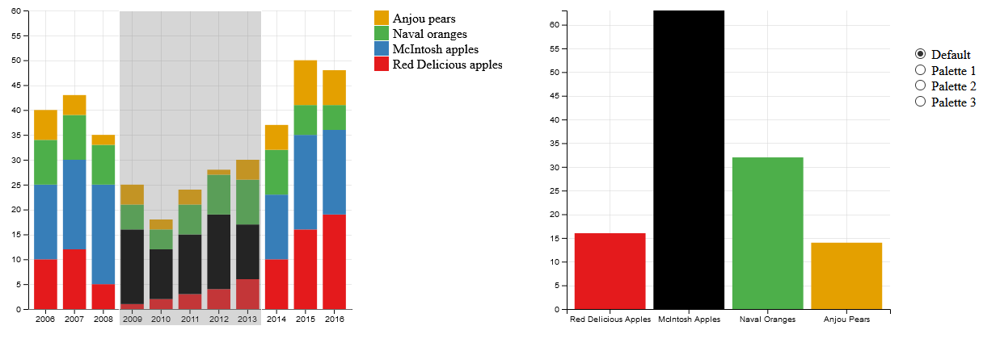

Assignment 4 - DataVis Remix + Multiple Views.
===

My project can be found at [here](https://bearl.dev/04-Remix/) and it is a remix of [this](http://bl.ocks.org/mstanaland/6100713) project from bl.ocks.org.

## Project Description

The original viz was a simple stacked bar chart where the X axis represents a year and the Y axis represents the amount of fruit with each bar in the stack representing a different type of fruit. The original article doesn't describe the specifics of the data so all information on it has to be inferred by the data and original viz directly.  Originally, the bar chart looked like this: 

Looking at the chart, I was immediately dissatisfied with the visuals for two major reasons. First was the overall aesthetics and color choice. The choice of red, yellow and black is very hard on the eyes and visually unappealing. Looking directly at the hex values of the colors used, you can see that only a small portion of the color scale.  

 

Looking at the individual colors, the colors used for Anjou Pears and Naval Oranges are very close and almost create a gradient, as the light yellow almost fades into the white background.  

My second major issue relates to the first as I, someone who is not visually impaired, has trouble with the colors. I would imagine someone who is visually impaired would struggle as well. Running the photo of the viz through a [color blindness simulator](https://www.color-blindness.com/coblis-color-blindness-simulator/), I've created the following images.

|                       Red Color Blind                        |                      Green Color Blind                       |                       BLue Color Blind                       |
| :----------------------------------------------------------: | :----------------------------------------------------------: | :----------------------------------------------------------: |
|  |  |  |

Looking at these images, I find that the gradient issue I mentioned earlier is still present and, in some cases, is much worse; such as with those with red color blindness and green color blindness. With these two specifically, the differences in color between the Anjou Pears and Naval Oranges is almost indistinguishable and requires close looking to spot the difference. Upon this realization, I knew that the color palette had to significantly change and I then began my remix of the project. 

This is what my final viz looked like:

For my remix, the first thing I did was to change the color palette to the one you see above. Additionally, I found the article [Inclusive Color Palettes for the Web](https://medium.com/cafe-pixo/inclusive-color-palettes-for-the-web-bbfe8cf2410e) which features three color palettes designed to accommodate those with color blindness. I implemented these palettes and allow the user to choose which one they want by using the four buttons on the far right.  

To add interactivity, I added the chart on the right. This chart is the sum of the values of each fruit, separated and organized in a bar chart. Initially, the chart displays the average of each fruit for all years, however, the user is able to brush over a range of years to see the sum of the values of those select number of years. In the picture below, I brushed over the years of 2009-2013 and the bar graph updated to match the newly selected years. 

I also added interactivity to the bar chart on the right. By hovering your mouse over a bar on the right chart, all of the bars that bar summarizes will be highlighted. For example, in the picture below, I'm hovering my mouse over the McIntosh Apples bar on the right. Since that bar chart represents the entire chart on the left, all of the McIntosh Apples sections are highlighted. 

This also works when a section is brushed. In the picture below, the left chart has been brushed for the years 2009-2013 so when I hover my mouse over the McIntosh Apples section of the chart on the right, only the McIntosh Apples sections of the brush years will be highlighted.

# Achievements

## **Technical Achievements**

- I converted the project from using d3 v3 into  using d3 v4.
- The data in the project was all stored in a local variable called `data` as an array of objects. I took all of the data and converted it into a CSV named `data.csv` found in this repo. 
- I implemented [d3-interpolate](https://github.com/d3/d3-interpolate) to convert the brush coordinates into the appropriate years the brush is covering which is then used to update the linked bar chart on the right.

### **Design Achievements**

- For the newly added bar chart, the grid pattern dynamically updates to match the number of ticks on the Y axis legend.
- Besides the default palette, the user has the choice of viewing the charts with three additional palettes. These palettes are taken from the article [Inclusive Color Palettes for the Web](https://medium.com/cafe-pixo/inclusive-color-palettes-for-the-web-bbfe8cf2410e), these palettes are designed to accommodate those with color blindness.  
- When using the right bar chart to highlight segments of the left stacked bar chart, the corresponding bar on the right chart will also be highlighted to give the user feedback that the bar is being selected.  
