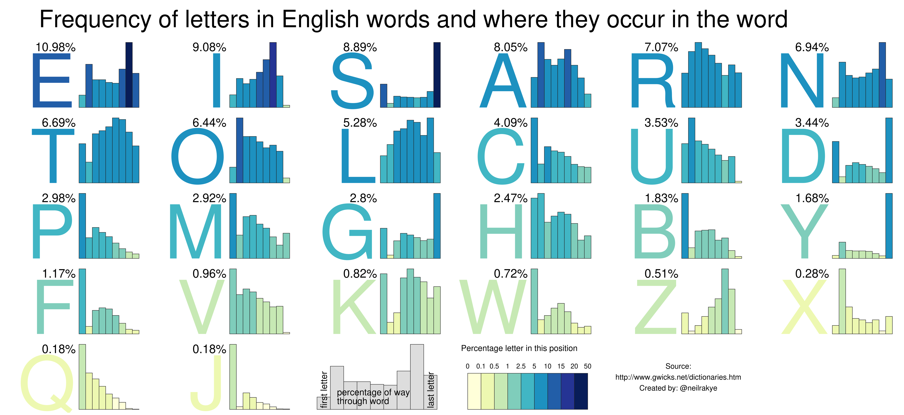
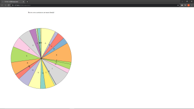

Assignment 4 - DataVis Remix + Multiple Views
===

# Writeup

Note: Talked to Professor Harrison about using my one late project extention for A4

Link to project [here](https://njwood.github.io/04-Remix/)

The vis I picked was something that I saw on r/dataisbeautiful. I dont think the data was displayed in the best way possible as it was Letter with a large percentage at the top. That was the main problem that I had with this visualization. The other portions were okay, and difficult to find ways to implement them into this project in a different way so I recreated the bar charts based on data visibility since it was hard to find actual data or csv's that contained this information. 

We can see that the original visualization was simple but also lacking in some areas, paticularly with each specific letter. 

The major change that I made to this visualization was a changing the data into a Pie Chart that can be seen here. I think the change to a pie chart gives a visual way to see the differences between the letters (some even very very hard to see on the chart). With the divides in the chart it shows the scale of what letters are used a lot more in the English Language compared to others. 

The link I had added to this was that when you hover over a certain portion of the chart, a bar chart representing the distribution of where the letter falls in words will render on its right. When hovering over another part, it will rerender with the graph of that corresponding letter 

I think that this visualization was difficult to come up with a creative way to do a lot of things since the only actual "data" was given by the percentages and for the bar charts I had to eyeball the data based on the legend that was displayed. 

The design achievement that I had was just the colorscheme of the pie chart as it alters based on the value that the character has. 
The technical achievement that I have is the dynamic rendering of the bar chart when you hover over a corresponding letter.
