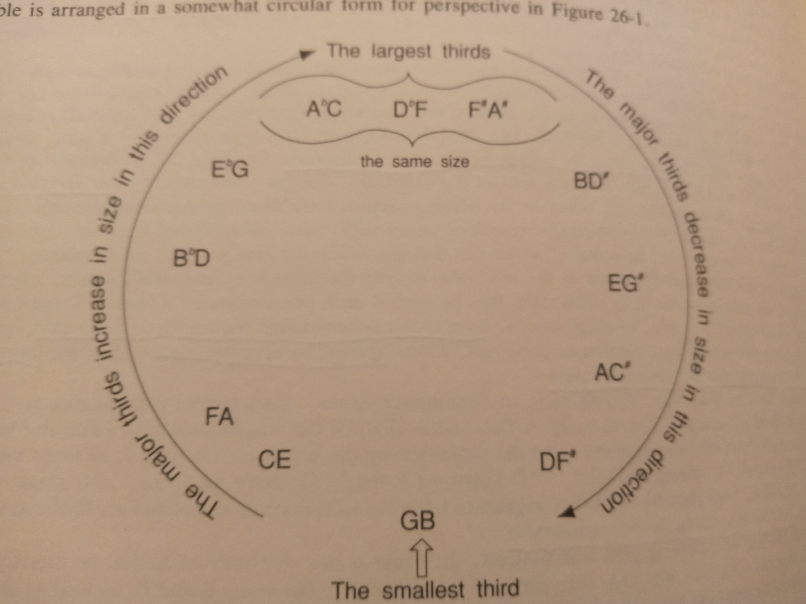
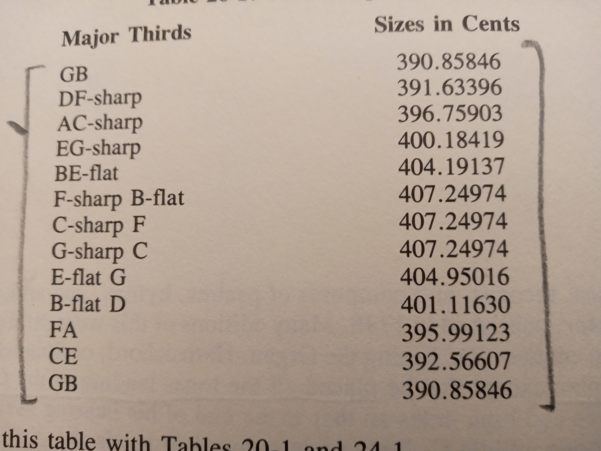
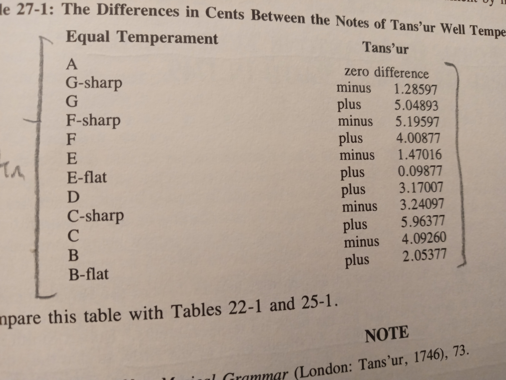
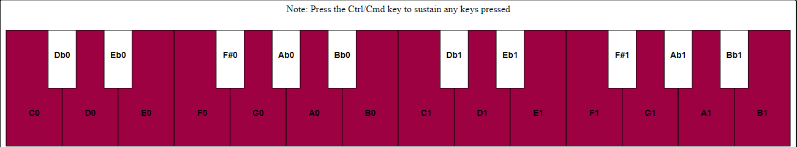
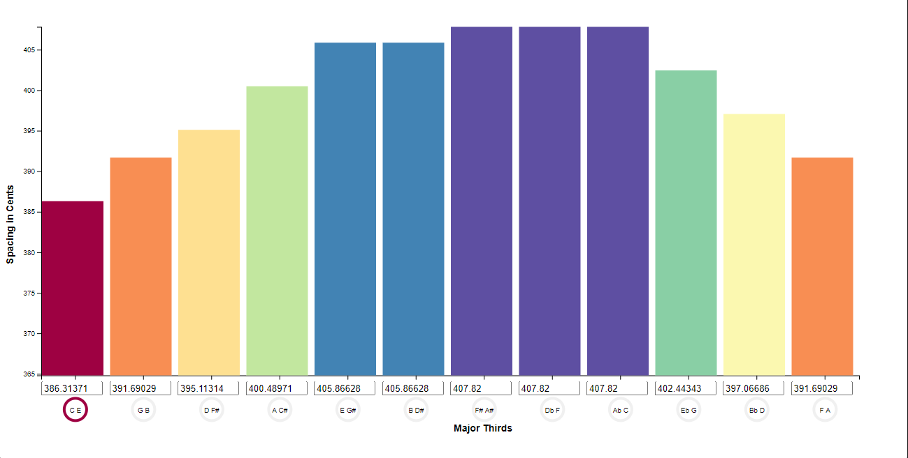

Assignment 4 - DataVis Remix + Multiple Views
===

Project by Benjamin M'Sadoques

Link To Working Vis: https://bgmsadoques-wpi.github.io/04-Remix/

(No link to the origional vis can be provided since it is in a book)

The Original Vis
===

The original vis(s) are from a complex book on Tuning by Owen H. Jorgensen, published in 1991. I chose this vis because I wanted to update it for modern day vis and to work better for people who do not have a deep understanding of music theory.

The origional vis is meant to help people discover the key color contrasts for different well temperament systems, based on the spacing of major third intervals. The user would look up a specific key or browse all the keys to learn the key color contrasts of the well temperament. They would take the major third and derive the major key associated with it. They may compare the different keys based on the spacing of thirds. The circle is meant to symbolize that the spacing of thirds generally follows the circle of 5ths. Then, outside the present work, the user would derive or tune a piano to the well temperament system, following the book's tuning instructions, and play a song in different keys, so the user can hear the different key characteristics. Users may want to compare this variation of well temperament to another well temperament. To do that, they would need to look up where that chart is in the book.

[1]

There are a few problems with the vis that make 
the user tasks difficult. Users who do not understand music theory will not know each major key, so deriving the key from the major third may require external knowedge. Comparing two keys can be difficult, especially when they are on oposite sides of the circle. The author always adds specific marks to clarify that certain keys are the same spacing, this form of grouping makes it clear that two or more keys do not contrast eachother. The book provides decent tuning instructions, but tuning a piano takes a long time and can be difficult, so users may not have a good method to hear the key color constrasts for themselves. Comparing different forms of well temperament requires manual look up.

The Data
===

The data in the files is also from the book. To create both vis,
I had to take two different pieces of data. The first piece of data was a table that shows the spacing of the thirds in cents, so the exact numbers used to make the origonal circle vis.

The second piece of data was a table that showed the spacing between the well temperament and equal temperament in cents. I used that to derive each well temperament so they are playable.

The Remix
===

To help the user derive each key, I added a second view that shows a simple keyboard. The keyboard will show users where every note or letter is and color code notes that are within each key. This change will help users visualize and play the key.

To help the user hear the key color contrasts, the keyboard is playable by clicking on it. The keyboard has visual feedback when mousing over keys or clicking on them. The user can hold the control key to sustain any notes they press so they can compare intervals when hearing them simultaneously. The keyboard is tuned to the same well temperament as the visualization. the keyboard allows users to sustain notes with the ctrl/cmd key so they can hear notes simultaneously (Note: there are some bugs with the library I used, so excessive playing may cause some notes to last forever)

To help users compare different keys, I added a bottom vis
where users can select which key to view in the top vis by clicking on the major third. The bottom vis also allows users to create their own well temperament by changing the values in the text box, it prevents them from breaking the system by creating a false major third that is too narrow or wide. The major third limits are shown by the axes.

To help the user compare different well temperaments, I added a simple drop down menu to select different well temperaments from the book. I did not include all the well temperaments from the book due to time constraints.

I do not think anything I did qualifies as a technical achievement, and I have no time to write about it

Sources:

[1] Owen H. Jorgensen. 1991. *Tuning: Containing The Perfection of Eigteenth-Century Temperament, The Lost Art of Nineteenth-Century Temperament, and The Science Of Equal Temperament* Michigan State University Press, East Lansing. 

Libraries: (besides d3)

Teoria: Used for some of my music theory
https://github.com/saebekassebil/teoria

WadJS: Used to make the audio easier to manage
https://github.com/rserota/wad
