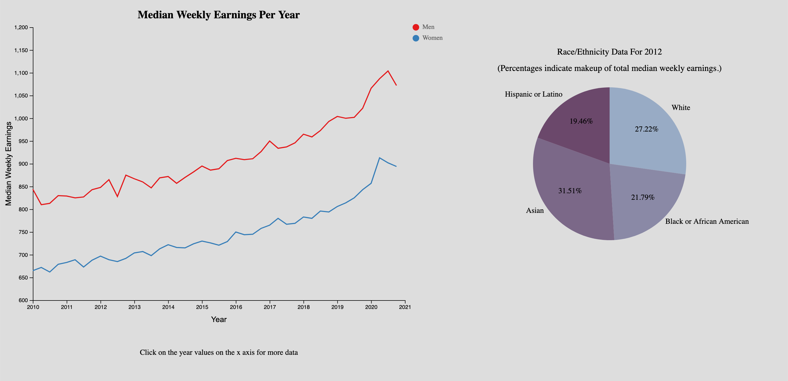

Assignment 4 - DataVis Remix + Multiple Views
===

This visualization is a remix of one I found . The data set used is earnings.csv in my repository, and I decided to remix the visualization by using a multi-line chart with a pie chart for additional details. The line chart displays both men's and women's median weekly earnings from 2010 up until 2021. This includes all races and ethnicities, however by clicking on a year on the x-axis, the pie chart on the right hand side will update to show the race/ethnicity breakdown of earnings for that year. This visualization is currently hosted on github pages and can be found  (https://jasondykstra.github.io/04-Remix/).

# Technical Achievements
This project of course has a linked view as per the requirements. By clicking on the year in the x-axis, the pie chart will update accordingly. On top of this, if you hover your mouse over the multi-line chart you will see the median weekly earnings for both the men and the women per quarter. The tooltip will look like this:

Creating the line and the small circles as a visual was difficult, on top of having to find the closest quarter to the mouse cursor. I achieved this by overlaying a large rectangle on the graph since "g" elements can't detect mouse movement, and retrieved the x coordinate values of the year ticks on the x-axis. By splitting the gaps up into four sections, I could determine the spots where each quarter of the year would be, and updated the line to snap to the quarter closest to the mouse cursor. 

# Design Achievements
I was able to create the graphs side by side using divs. Both charts lay on their respective SVGs which are inside of divs. Both of those divs are inside of a parent container which uses the flexbox display mode to align the inner divs horizontally. Additionally, I was able to use these adjusted coordinates insdie of the SVG to center text, labels, and charts. On the pie chart specifically, I was able to put labels on the outside of the pie chart neatly by determining which side of the pie chart the label was on. If the label was on the left side of the chart I would anchor the text to the left, and if the lable was on the right hand side of the pie chart I would anchor the text to the left. For both the pie chart labels and percentages, I applied them to the chart by creating a smaller and larger arc around the pie chart with the same specifications for angles as the main chart. 

