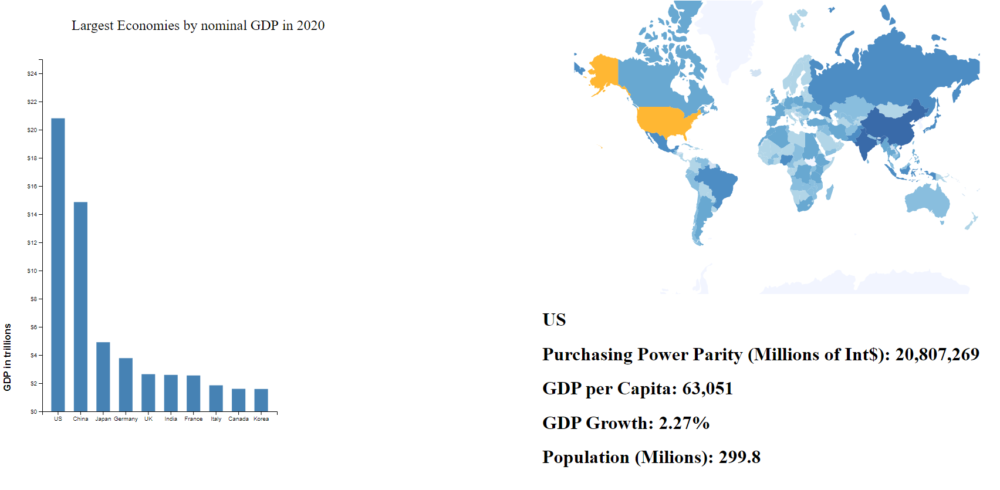

Assignment 4 - DataVis Remix + Multiple Views
===

https://felchen.github.io/04-Remix/index.html

I recreated a bar chart showing the ten countries with the highest nominal GDPs in 2020. The remix includes a bar chart similar to the original and also includes a separate map of the world where when you highlight countries in the bar chart, their location on the map is also highlighted and some additional data is shown.

The original visualization is linked below

https://upload.wikimedia.org/wikipedia/en/timeline/68c8e21686a0dee92d88c47c5dc916a3.png

- Working link to the visualization hosted on gh-pages or other external sources.
- Concise description and screenshot of your visualization.
- Description of the technical achievements you attempted with this visualization.
- Description of the design achievements you attempted with this visualization.

Technical achievements
---
When the bar chart is moused over, the country is highlighted on the world map as well as additional information being shown underneath the map.

Design achievements
---
For my design achivements, I had a matching color scheme for both the bar chart and the world map. The countries on the world map were also shaded based on their population with countries with higher populations shaded more darkly. The two visualizations are also layed out next to each other so that it is easy to look at both of them at the same time.
