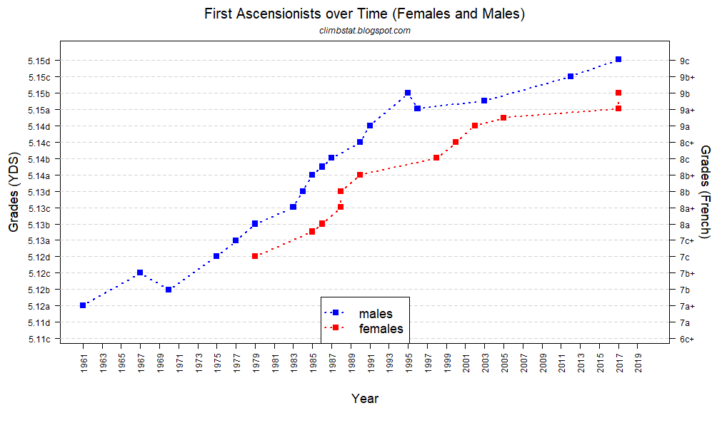
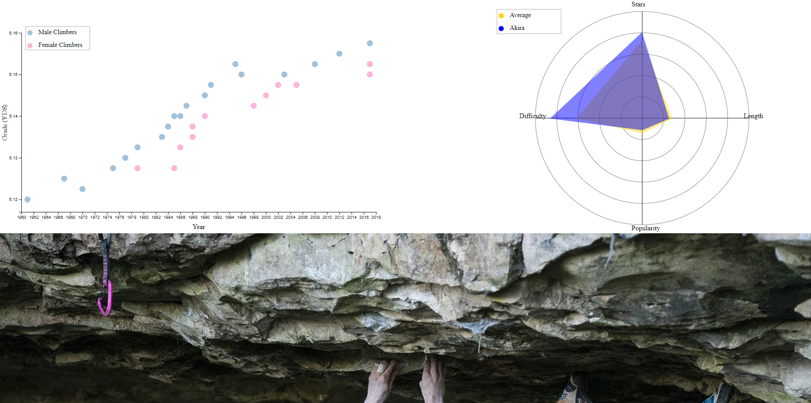

## Assignment 4 - DataVis Remix + Multiple Views
### Luke Gebler

## Github pages link:
    https://luke-gebler.github.io/04-Remix/

## Data
My initial source of data can be found under data/first_ascent.csv. This data is what is used in the original visualization as well as my scatter plot. 
My second source of data can be found under data/RouteData.csv. This data was gathered by me through my own research which I will talk about more in the achievements section. This data was used for the construction of the linked spider chart.

# Visualizations

## Old
This is the inital visualzation, it shows the data of "first ascents" on climbing routes throughout the years. A first ascent means the first time a certain route has been climbed ever. On both the left and right you can see the grading scale for the climb, which is actually repeat information as most climbers know how those scales coorespond to eachother and non-climbers dont know what either of them mean. There are no interactive features and the style of the data points is outdated, as well as the graph being cluttered by repeat data.

## New
For my vis, specifically the scatter plot. I decided to cut out the right y-axis completely since it was effectively useless. Using d3 I was also able to make it overall look much nicer with rounded data points and an overall cleaner look. I still decided to split up the male and female climbers as I found that to be useful information.

For the interactive part of my vis, you are able to click on any of the data points and a spider graph will appear on the right as well as a picture of the route below. The spider graph compares a few different data points; the stars it received as a rating online, the difficulty of the climb, the length of the climb, and the popularity (in terms of site visits). The gold cooresponds to the overall average of all climbs while the blue is the specific climb that was selected. I was hoping this could help visualize a coorespondence between a few of the variables but it appeared rather random and uneffected by eachother.

# Achievements

## Technical
- Created a spider/radar graph which I had not yet seen done in this class. I understand where this type of graph can fall short in terms of data representation but I believe it was used effectively here.
- All of the data used in the spider graph as well as all of the images were gathered by me through research into each climb, this took the majority of the time on this project.

## Design
- Legends were added to both graphs for ease of data consumption
- Each picture chosen tried to show the routes as best as possible. Unfortunately, some of the climbs have since been closed for decades, causing the resolution of the best picture I could find to be rather small. Some pictures such as the top right data point and one below it, actually feature the climber that completed the first ascent.  
