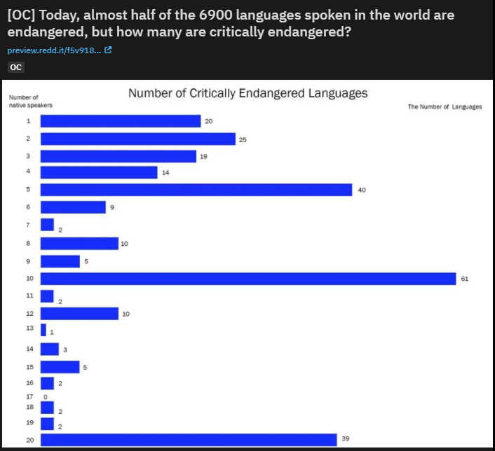
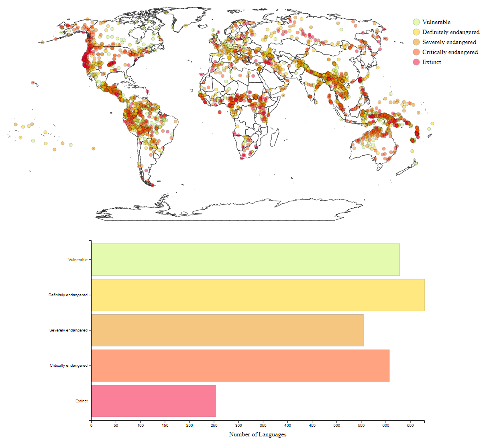
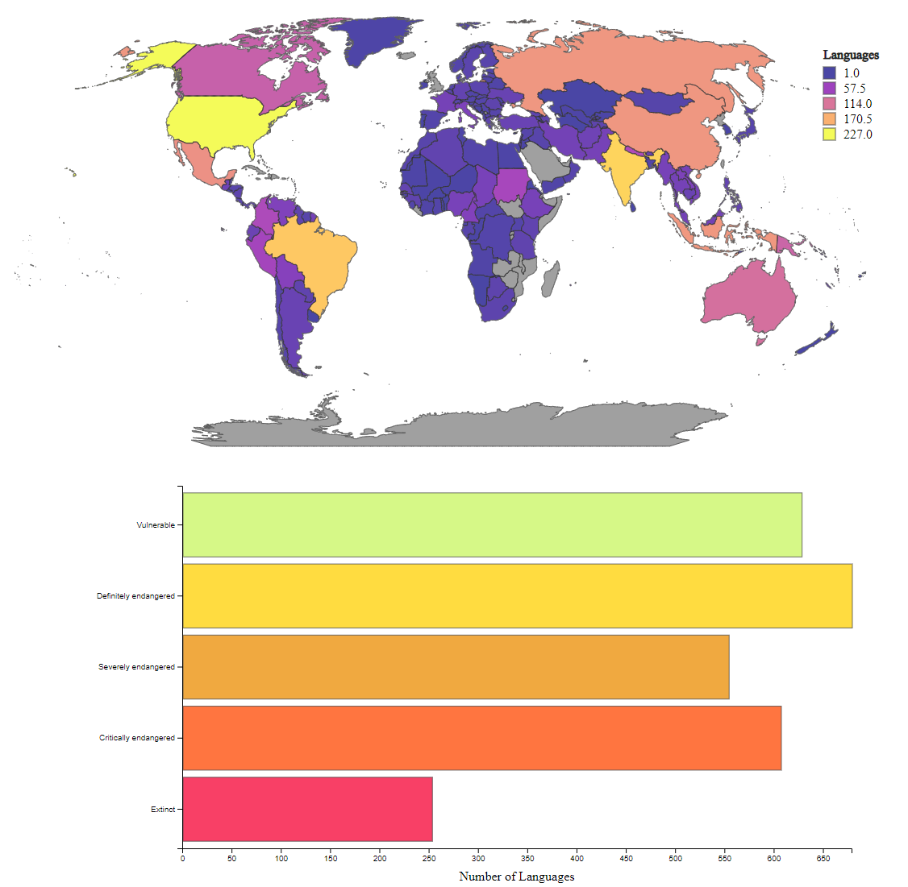

# Assignment 4 - DataVis Remix + Multiple Views

[https://nyoma-diamond.github.io/CS4802-04-Remix](https://nyoma-diamond.github.io/CS4802-04-Remix)

## Original Visualization

The original visualization which mine is based off of is from [this post](https://www.reddit.com/r/dataisbeautiful/comments/m0z52s/oc_today_almost_half_of_the_6900_languages_spoken/) to [r/dataisbeautiful](https://www.reddit.com/r/dataisbeautiful/):

When I first saw this visual I was rather confused, not just because it's a little unclear what it is trying to show, but also because there isn't really a lot of meaning behind it. The distribution of critically endangered languages relative to their number of native speakers isn't really a useful statistic (looking at languages within a category isn't as meaningful as comparing to other categories). As such, I made it my goal not just to remix this data to make it more usable, but also to make it more meaningful in general by putting the data in perspective. Rather than just looking at critically endangered languages, I'd look at all degrees of endangerment (including extinction), as well as where geographically endangerment is occuring.

## First Attempt

My first attempt at remixing this visualization was to build a map with all the languages plotted on it as dots (the dataset came with longitude and latitude values for each entry), colored by their endangerment status. The dots on the map could be highlighted to get information about the language, and the legend on the right could be used to filter the map. The bar graph underneath the map showed overall numbers for how many languages fit into a certain category, and hovering over one of the bars would show only the corresponding dots on the map (clicking on it would lock this selection).

The problem I had with this visualization is it didn't feel like there was a meaningful connection between the bar graph and the map. The bar graph felt like it was just sort of "there". The map also was kind of clunky to use and less responsive than I'd like, and for the purpose of the assignment it didn't really fill the requirements as while something done to the bar graph affected the map, nothing happened the other way around. While not a bad visualization (and in my opinion much better than the original), I wasn't really happy with it in the end, leading me to rewrite most of the visualization from scratch to try a different route.

## Second Attempt

In my second attempt I decided to have less of a focus on the individual languages, and more on the overall trends. Something that was missing from my first attempt was information about where the languages were spoken. Many languages, despite having a single location, were listed as being spoken in multiple countries. As such I did some modification to the data so as to be able to get more meaningful insight out of it (this also means that one language may contribute to the counts of multiple countries, but personally I believe that is okay, if not a better way to handle this). Now, instead of using dots to indicate every single language, I colored each country by how many vulnerable, endangered, and/or extinct languages are/were spoken in them. When not hovering over a country, the bar graph displays the overall values for the world. When hovering over a country the bar graph displays the breakdown for the selected country. When hovering over one of the bars in the bar graph, the map will adjust to exclusively show languages in that category (e.g. if you hover over "Extinct" the map will only show counts for extinct languages). Lastly if you click while hovering over a country, you can toggle the tooltip to show the list of vulnerable, endangered, and extinct languages spoken in that country and the number of speakers. The tooltip isn't perfect and will go off the screen and/or cover content when hovering over countries with lots of languages, such as Brazil, Russia, or the USA, but it is interesting to see nonetheless and if I had more time I very much would have liked to improve the tooltips.

## Final Implementation

For my final implementation I decided that rather than completely scrapping my original code, that I could improve the meaningfulness of the visualization by linking both versions. As such, both versions (which are on separate pages) are accessible at [https://nyoma-diamond.github.io/04-Remix](https://nyoma-diamond.github.io/04-Remix). While on its own my second attempt is (in my opinion) a good and meaningful visualization, it is improved when it can be used in conjunction with my first attempt, so both are available.

## Technical Achievements

- By splitting out the code carefully so it could be reused, I made it so the map could be dynamically recolored based on data. This mean that I wouldn't need to regenerate the map whenever I wanted to update it, which would be bad for responsiveness. This means that the map can update instantly when hovering over the bar graph. It also updates the scaling and the legend automatically.
- Also through careful coding I was able to make the bar graph update very quickly when hovering over a country, including updating the scales.
- (Not sure if this really counts, *but*) I used Tableau Prep to clean the dataset and create new views for the data that I could work with. This greatly helped as not only did it mean I didn't need to mess with the data in code (which could slow things down), but because I could have one workflow which would alter all my datasets accordingly should I need it.

## Design Achievements

- While not very useful, something I'm proud of is the filtering on the first attempt. Working with two filters that operate in inherently different ways (hide the selected vs show only the selected) can be difficult when both can be locked. As such I decided to make it so the legend filter would be persistent, while the bar graph's filter would override anything currently happening. As a result, it's pretty much impossible to do something unintended with the filters, and it allows you to make quick comparisons like "all non-extinct languages vs extinct languages" rather than just looking at single categories at a time.
- Wherever possible I implemented opacity adjustments to make interactivity obvious. All elements are naturally not fully opaque/saturated, meaning that when hovering over/selecting something it can become opaque while other elements become more transparent, making it extremely apparent what is being/that something can be selected, while not hiding any information. This is particularly important for my first attempt visualization, as the bar graph selection can be locked, so I needed some way to indicate when a lock was placed, and opacity works well for that too. This also allowed me to indicate whether or not changes could be made to the filter: e.g. when no filters are in place, you can hover over the legend to implement filters, and the opacity will change to indicate this, however, when a lock is in place from the bar graph the opacity will not change on the legend, indicating that you cannot change those filters until the lock is lifted.

## References

- [https://www.reddit.com/r/dataisbeautiful/comments/m0z52s/oc_today_almost_half_of_the_6900_languages_spoken/](https://www.reddit.com/r/dataisbeautiful/comments/m0z52s/oc_today_almost_half_of_the_6900_languages_spoken/)
- [https://www.kaggle.com/the-guardian/extinct-languages](https://www.kaggle.com/the-guardian/extinct-languages)
- [https://d3-legend.susielu.com/](https://d3-legend.susielu.com/)
- [http://bl.ocks.org/biovisualize/1016860](http://bl.ocks.org/biovisualize/1016860)
- [https://bl.ocks.org/d3noob/d805555ee892425cc582dcb245d4fc59](https://bl.ocks.org/d3noob/d805555ee892425cc582dcb245d4fc59)
