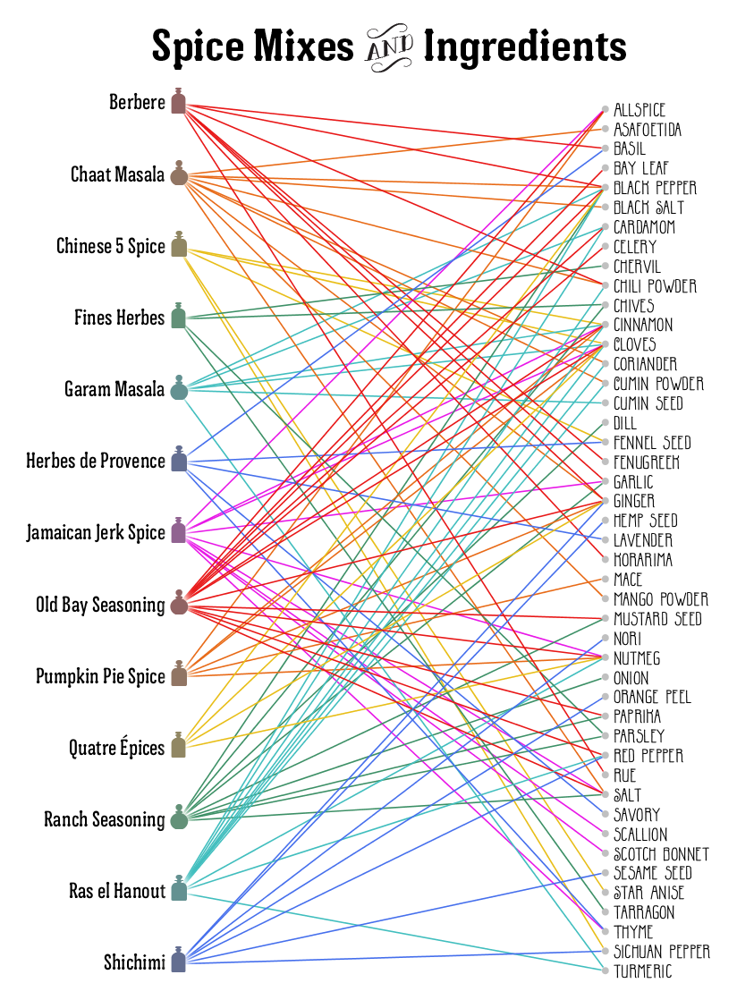
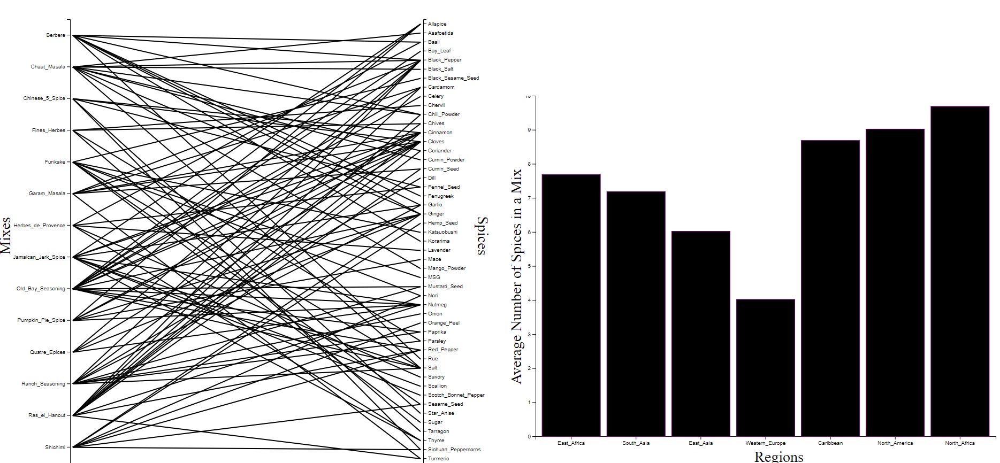
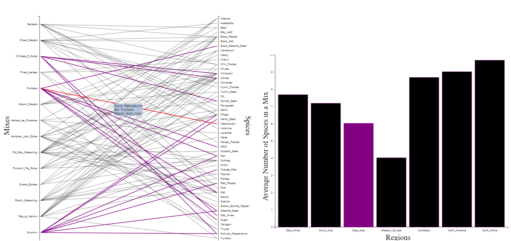

# [Spice Blends - Remixed](https://hcaouette.github.io/04-Remix/)
---
### Viz Source:  
[Spice Mixes and Ingredients](https://ragbag.tumblr.com/post/35124794211/raynor-ganan-signature-masala-one-of-my-2012)  
### Original Viz:  
<!--    -->

 

My viz is based off of the dual-axis graph that I found on the linked Tumblr post. I liked the author's idea of showing the commmonalities between different spice mixes, and thought that I could improve on the usability of the visualization.  
Default Viz View:  

 
Obviously, the original version of the visualization is a lot more colorful. This is helpful when you are trying to find out what spices are in each mix, since the original visualization is static. However, since the color palette begins to repeat and some of the colors are rather similar, it can be difficult to follow the lines when they begin to cross over each other. I found this out firsthand, as I copied down all of the data into the mixes.json file that I compiled to index the spices.  
Since my version of the viz is in black and white it is nearly impossible to follow the threads from mix to spice and vice versa. This was intentional, and is part of my strategy for adding the mouseover animations. Since the lines are all in black, when the opacity of the lines goes down and some lines become colored, the effect of the transformation is much more prominent than had the lines all been colored to begin with.  
There are 2 color codings that go on in the chart; red lines are connections to all of the mixes that use the selected spice. In the example screenshot you can see that 3 lines have been highlighted in red, pointing to the 3 spice mixes that use Katsuobushi. Purple highlighing pertains to the supporting graph, and highlights lines to all other mixes that share a region with the select line. While this may appear a bit messy, it is not hard to trace highlighted lines back to the originating mix, and it is nice to see what other spices mixes from the same region incorporate. Additionally, the tooltip provides some at-a-glance information about the selected spice-mix connection without having to bounce between the sides of the graph.  
The supporting graph on the right-hand side is a simple column chart, showing the averge number of spices used in a mix for each of the regions represented in the data. Althought it is relatively simple right now, if the dataset of spice mixes were to be expanded I think that this could provide some really cool insights. Currently, however, its primary function is to serve as another type of slicer for the data. The highlighting works the same way as the purple-line highlighting described for the lines, as the lines and the graph use the same function to apply formatting. Additionally, when highlighting lines in the dual-axis chart, the corresponding region in the column chart is formatted purple to match the lines.  
Highlighted Viz View:  

 

Tech Achievements:
- Cross-highlighting between two different svgs in two separate divs by applying a generous number of classes to lines and bars.
- Appearing and disappearing tooltip provides quick information when hovering over different connection lines in the dual-axis chart.

Design Achievements:
- High Contrast between the default view of the visualization and the highlighted view make it easy to pick out which lines are important and which to ignore.
- Simple, centered and well spaced design makes it easier to interact with a relatively complicated graphic.