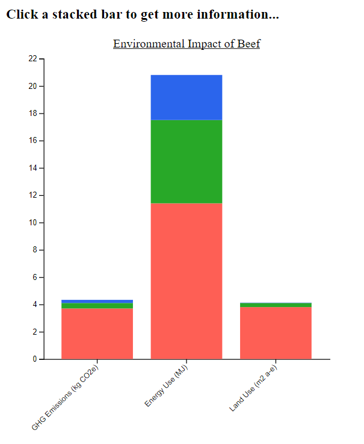
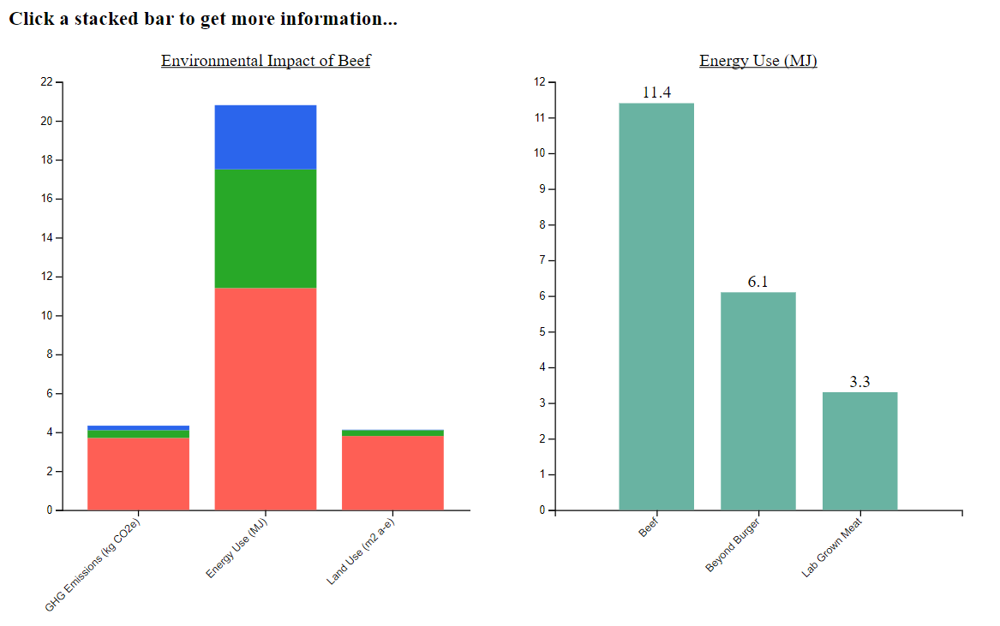
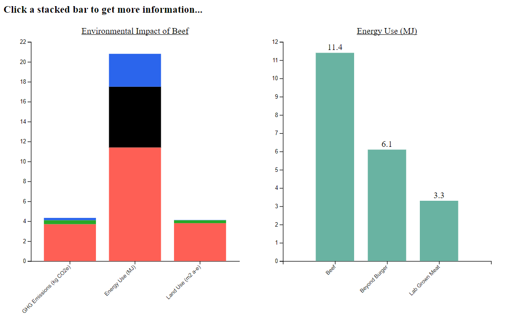

Assignment 4 - DataVis Remix + Multiple Views
===

Link to my visualization: https://vygrasso.github.io/04-Remix/index

For this assignment, I found a visualization on Reddit (https://www.reddit.com/r/dataisbeautiful/comments/lww5wc/the_environmental_impact_of_lab_grown_meat_and/) which I found interesting and decided to remix it. I thought the separate graphs gave readers lots of information but I thought I could compact it into one stacked bar graph.

Each stacked bar represents one of the original graphs. I trimmed the data so it would all fit and make sense on one stacked bar chart and put it in one CSV. The three environmental impact categories I chose to compare in the stacked bar chart were Greenhouse Gas Emissions, Energy Used, and Land Used because they had values that could be represented on the same axis. Each stack has 3 sections: Beef, Beyond Burger, and Lab Grown Meat.

In order to complete the multiple views and linking part of the assignment, I created three bar plots that would be shown when the stack was clicked on. The bar plots were created using a second SVG and depending on which stack/impact category was selected, a different bar plot would appear. I organized the visualization this way so the values from the stacked bars could be read easier. 

I also added linking back from the second SVG to the first by having users click a bar which will turn the respective section black on the first plot.

Technical Achievements:
---
- Used 4 CSV files to create 4 plots - depending on the data selected, a different plot was generated
- Used a line of code so generated bar graphs did not plot on top of each other: svg2.selectAll("*").remove();
- Formatted decimals using d3-format

Design Achievements:
---
- The stacked bars are color coded to make sense: Red signifies Beef, Green signifies Beyond Burger (a plant-based patty), and Blue signifies the Lab Grown Meat
- Added titles to each graph
- Added the values above the bars in the second plot to easily read data

Resources:
---
http://www.d3noob.org/2013/01/adding-title-to-your-d3js-graph.html
https://stackoverflow.com/questions/3674265/is-there-an-easy-way-to-clear-an-svg-elements-contents
https://www.d3-graph-gallery.com/graph/barplot_stacked_basicWide.html
https://github.com/d3/d3-format
