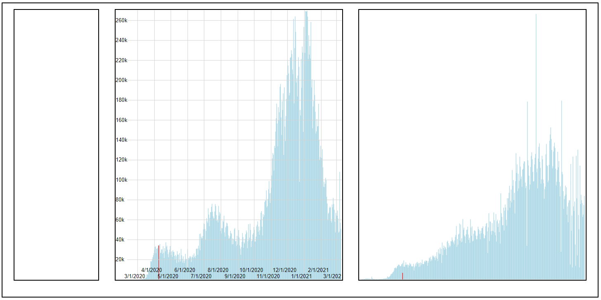

Assignment 4 - DataVis Remix + Multiple Views
===

For my assignment I decided to remix the coronavirus visualization from the NBC webiste, I my biggest annoyance with it is that it is very hard to tell what is going 
on, and that there is no relation between it and the world data. So I decided to create a visualization where one could see the comparison between the world covid cases and 
the us cases. I also wanted to make it so you could look at rate of change, but as you will see, this clearly did not happen.

## The Vis

The Vis consists of two linked svg's of data, the data coming from the csv file that NBC used for their original. Hovering over a bar in either data set will highlight the corresponding bars. As you can tell by the side of the vis I planned on having an interactive tool bar, but that did not happen.

## Technical Achievments

I acknowledge that there are no real technical achievments, but seeing as I didn't know what the DOM was before this class, everything feels like an achievment. Also, this has taken too long not to wite anything. 
- set up the layout of the page (the DOM is confusing)
- making the axes and scaling them, specifically, translating them into position was hard
- extensive use of jquery
- used dispatch and listeners to link events and passed variables through the listeners

## Link to Vis
https://scvoltmer.github.io/04-Remix/

## Acknowledgements
- Javascript and Jquery by Jon Duckett
- HTML and CSS by Jon Duckett
- Learn D3.js by Helder da Rocha
