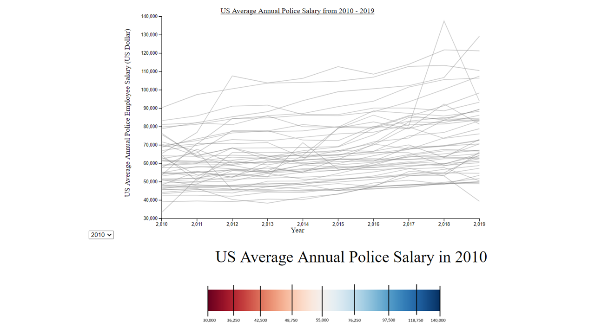
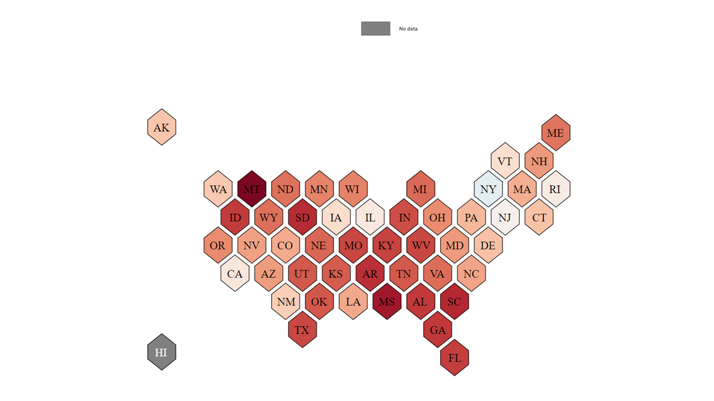
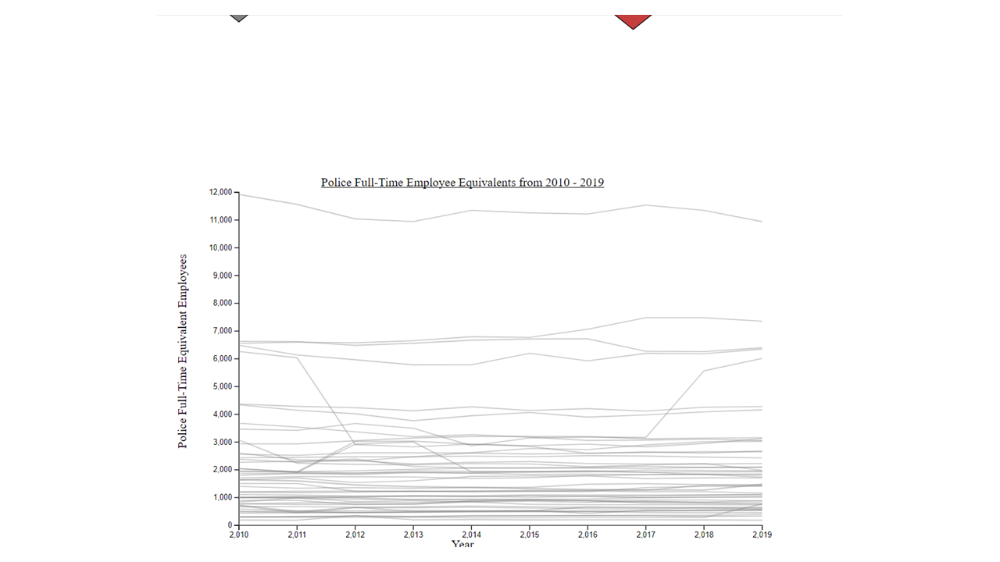
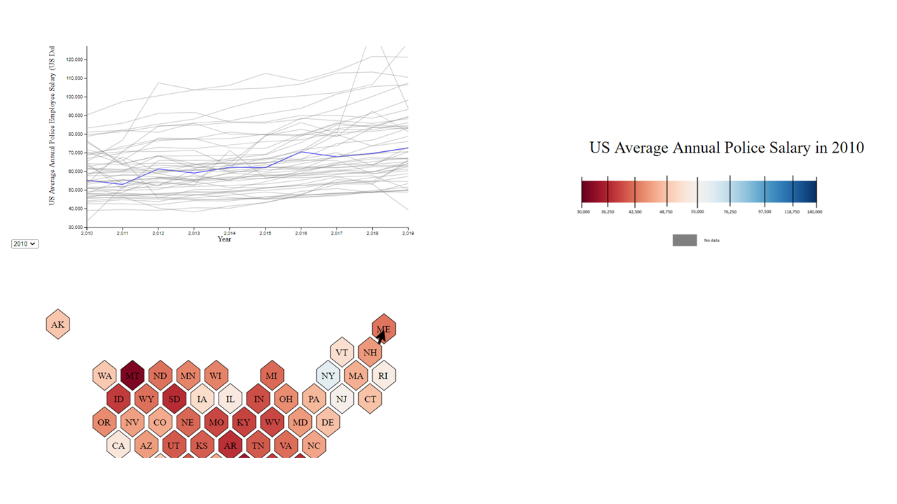
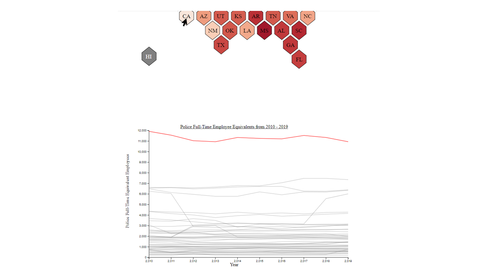
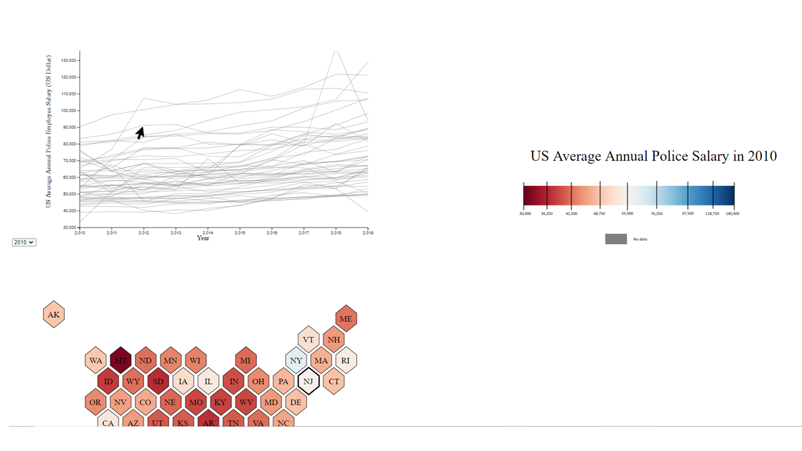
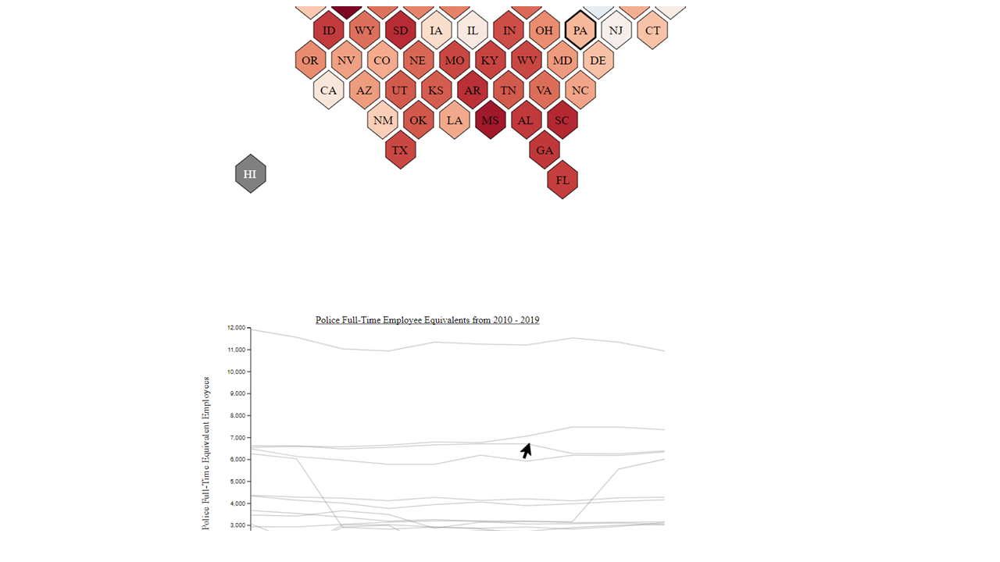
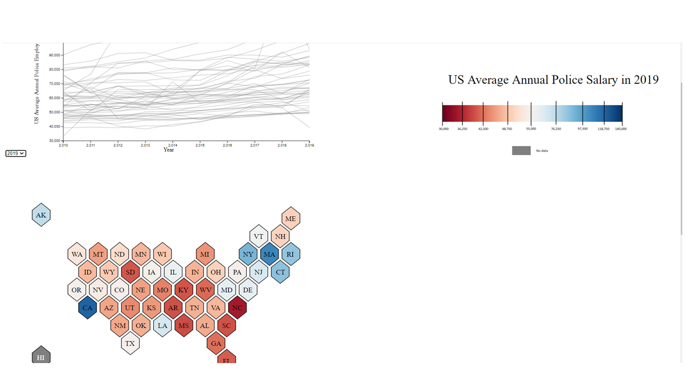

Assignment 4 - DataVis Remix + Multiple Views
===

Project Description
===

[Link to the project on my git-hub pages]()
Now the actual link:

Within this assignment, the task was to remix an existing visualization in some way. In this case, I remixed a visualization the looked at Annual Police Salary by state (citation 1). Although the visualization itself is nice, its colors appear too similar in many instances to discern the approximate values bewteen annual police salary of states with similar annual salaries or those with coloration slightly different but placed alongside eachother. In addition, the data used to calculate this was misrepresented in the original visualization. While the visualization said it should annual police salary, it only should an average salary of police who had the power to arrest. The original author does not show the complete picture in this case.

In my remixed version of that data visualization, I take these criticims into account. I adopted a scale that had a red to white to blue colors with red being the minimum and blue being the maximum value. Additionally, my average annual salary calculation included all police employees in terms of full-time equivalent employees. In addition, I remade the hexagonal map such that the average annual police salaries are able to be displayed from 2010 to 2019 with the use of a select button. A title and legend accompany the hexagonal map. The legend itself contains some points to orient the viewer between what the various color values represent. A "no data" gray box is also displayed to explain the coloration of the hexagon representing the state of Hawai'i. A line graph that shows this information for each state is also provided. A line graph that shows the number of full-time equivalent employees from 2010 - 2019 for each state is also included.

There are many interactive elements within this visualizaiton. Begining with the hexagonal map of the US, the select button can be used to toggle the year that the user wishes to see average annual polic full-time equivalent employee salary. This is the same feature mentioned in the previous paragraph. In addition, clicking on the state initials text reveals two linking occurences. For that particular state, the line on the graph of average annual police salary is highlighted blue, and the line on the graph of the number of full-time equivalent employees is highlighted red. This makes discerning the graphs for a particular state easier. Clicking on another state intial text removes the previous highlights. Clicking on the same state intial text also removes the highlights. Clicking on Hawai'i's (HI's) state initials causes an error message to appear while removing all previous highlights.Switching years using the pull down menu also removes highlights. A third linking occurence can be seen using the average annual police salary graph in which Hovering over a particular line or point of a line causes the state pertaining to that line's hexagonal border on the hexagonal map of the US to increase in size. This lets the user note which particular line and/or point pertains to a particular state. The final and fourth linking occurence acts in a similar vein to the average annual police salary graph but involvig the full-time equivalent police employees graph. Hovering over a particular line or point of a line causes the state pertaining to that line's hexagonal border on the hexagonal map of the US to increase in size. Similarly, this lets the user note which particular line and/or point pertains to a particular state. To often seen all the effects of interactivity, the size of the browser/window must be adjusted. 

Concerning the data, the complete/total source list is not given. When examining the various files from the ASPEP, there was no record of any data for police being listed for Hawai'i. I am unsure where the original author got the data in order to accurately display Hawai'i. 

Technical Achievements
===
There are two technical achievements that I would like to acknowledge
1. I made use of a select button that functions to change the year that is being viewed on the hexagonal US state map. This represnted the data and remixed the original data visualizaiton in an interesitng way.
2. I made two linked visualizations. There are two line graphs linked to the hexagon map of the US. 

Design Achievements
===
There are four design achievements that I would like to acknowledge in this data visualization
1. I changed the color scheme of the visualization to utilzie a red to white to blue sequentially scaled color scheme. While the highligthed graph lines do match with this new set, it allows for easier visualization of the data that is not subject to hue differences alone.
2. I made a selected button to allow the user easy use in changing the year wished to be examined. It fits nicely below the graph in full-screen.
3. The data cited in the source of the documenation did not show average police salary, but rather showed annual police employee with power to arrest salary. My visualization accounts for this by properly naming the map, and the data that is inputted into the code is the annual police employee salary(those with the to arrest and those without). Additionally, the original dataset does not include any information for Hawai'i. I was not able to discern how the creator got the data for Hawai'i, and it is reflected in the visualizaiton.
4. Not only is police employ annual salary displayed, but also the number of full-time equivalent employees each year. 

Project Photos
===

Utilizing the three images above, the entire, resting visualization is pictured as one would encounter it when it is first loaded. There are two line graphs, a hexagonal map of the US, and a pulldown menu set at 2010. 

Pictured above is one of the linked aspects of the visualization between the hexagonal map of the US on the line graph of average annual salary. Upon selecting the text of any particular state, the particular line portaining to that state is highlighted. A similar effect can be seen between the hexagonal map of the US on the line graph of full-time equivalent employees. In this case, Maine (ME) is selected and the text is clicked. The zoom of the window is adjusted to better see the coordinated effect.

Pictured above is one of the linked aspects of the visualization between the hexagonal map of the US on the line graph of full-time equivalent employees. Upon selecting the text of any particular state, the particular line pertaining to that state is highlighted. A similar effect can be seen between the hexagonal map of the US on the line graph of average annual salary. In this case, California (CA) is selected and the text is clicked. The zoom of the window is adjusted to better see the coordinated effect.

Pictured above is the other linked aspects of the visualization between the line graph of average annual salary on the hexagonal map of the US. When mousing over a specific line, the state the line pertains to bolded by a strong border on the hexagonal map of the US. A simialr effect can be seen between the line graph of full-time equivalent employees on the hexagonal map of the US. In this case, the line for New Jersey (NJ) is being hovered over, and thus the state represented in the hexagonal map is bolded out.

Pictured above is the other linked aspects of the visualization between the line graph of full-time equivalent employees on the hexagonal map of the US. When mousing over a specific line, the state the line pertains to bolded by a strong border on the hexagonal map of the US. A simialr effect can be seen between the line graph of average annual salary on the hexagonal map of the US. In this case, the line for Pennsylvania (PA) is being hovered over, and thus the state represented in the hexagonal map is bolded out.

Pictured above is the selection feature of the drop-down menu in action. When a paritcular year is selected, the hexagonal map reflects this change by adjusting and visualzing the average annual salary of police employees in that state for the selected year. The year selected here is 2019. Comparing to the first set of photos can be useful.

Citations/References
===
1. [The link to the original vis that was remixed](https://www.reddit.com/r/dataisbeautiful/comments/lg2mo8/oc_average_police_salary_by_state/)
2. [The link to my inspiration for the select button in the project](https://observablehq.com/@jashkenas/inputs#selectDemo)
3. [The link to the d3 migration guide which was helpful in understanding the new ways of coding in d3 for specific functions](https://observablehq.com/@d3/d3v6-migration-guide#pointer)
4. [The link to the site I used to get a greater insight in mouseevents should they have become relevant in the project](https://observablehq.com/@d3/multitouch)
5. [The link to develop a background on drawing a line chart in d3](https://observablehq.com/@d3/line-chart)
6. [The link to the source I consulted when I had issues with my axes for the multiple line graph](https://www.tutorialsteacher.com/d3js/axes-in-d3)
7. [The source I used to understand how to make 2 svgs in one html page](https://www.chalcid.com/journal/2019/4/17/d3-dabbler-series)
8. [Another source that I consulted to develop my line graph](https://bl.ocks.org/d3noob/4abb9dc578abf070fe62302282a29c41)
9. [Another source for the line graph AND providing me the basis for the update function mechanic with the drop down menu](https://www.d3-graph-gallery.com/graph/line_select.html)
10. [The link to the source to figure out how to make the lines on the line graph less opaque](https://stackoverflow.com/questions/37597572/how-to-do-stroke-opacity0-with-d3)
11. [The link to the source in the original assignment for brushing and linking](https://observablehq.com/@philippkoytek/d3-part-3-brushing-and-linking?collection=@philippkoytek/d3-tutorial)
12. [Another source on line graphs in d3 that I pulled inspiration from](https://datawanderings.com/2019/10/28/tutorial-making-a-line-chart-in-d3-js-v-5/)
13. [A source used to understand sequential scales better in d3](https://observablehq.com/@d3/sequential-scales)
14. [The source used to better understand the extent function in d3](https://observablehq.com/@d3/d3-extent)
15. [This source provided the source for the scale legend found in svg 2](https://github.com/d3/d3-scale-chromatic)
16. [The original source of data used to create the original data visualization and my remixed data visualization](https://www.census.gov/programs-surveys/apes.html)

Assignment 4 Detailed Requirements
===

0. Your code should be forked from the GitHub repo and linked using GitHub pages.
1. Your project should load a dataset you found on the web from the vis you're remixing. You may extract the data by sight if necessary. Put this file in your repo.
2. Your project should use d3 to build a visualization of the dataset. 
3. Your writeup (readme.md in the repo) should contain the following:

- Working link to the visualization hosted on gh-pages or other external sources.
- Concise description and screenshot of your visualization.
- Description of the technical achievements you attempted with this visualization.
- Description of the design achievements you attempted with this visualization.