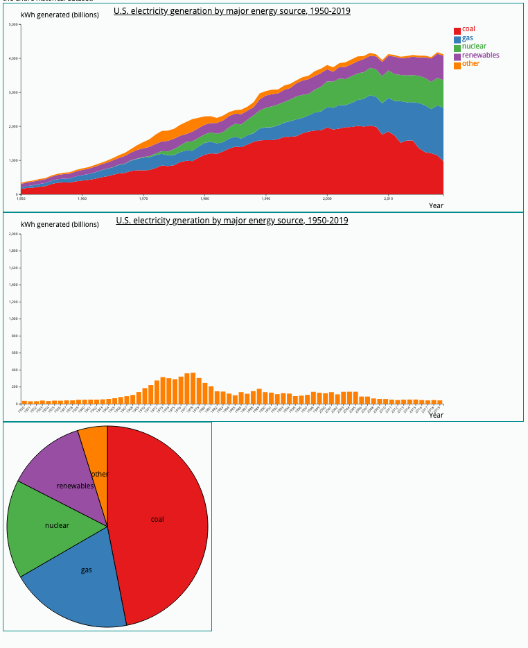

Assignment 4 - DataVis Remix + Multiple Views
===

Original Visualization: https://www.eia.gov/energyexplained/electricity/electricity-in-the-us.php
Remix Visualization link: https://clay-ol.github.io/04-Remix/ 
  This is a remix of the US Energy Information Administration's stacked 
  area chart of US energy generation by source.
Two additional visualizations have been added - a bar chart showing energy production by selected source as well as a pie chart showing percent compositions over the entire historical dataset.

I chose this for several reasons - I had not worked with a stacked area chart before and I wanted to gain experience with more types of visuals. I although that that this was ripe for linked views. 

For the linked view, I opted to have a bar chart. As the user scrolls over the legend in the primary view, this updates the class of data shown in the secondary view.

Design Achievements:
- Some CSS was added to add visual appeal of the page.
- A new font was chosen from Google Fonts to replace the default text style.

Technical Achievements:
- A third visualization was included (pie chart). Unlike the other two dynamic visuals, this is a static visual showing the breakdown of energy types over the entire dataset. I felt that this would be useful to see how America has primarily generated its power historically.
- Ability to zoom in on a section of the stack chart was added as part of the remixed visual. This feature was absent in the original visual and allows for the user to view a specific date range with ease.
- Tech stack: Data parsing and handling was done with Python and Pandas to convert the original dataset into something easier to work with. This included renaming fields and dropping fields. The dataset was once again exported to a CSV and then loaded with D3.
