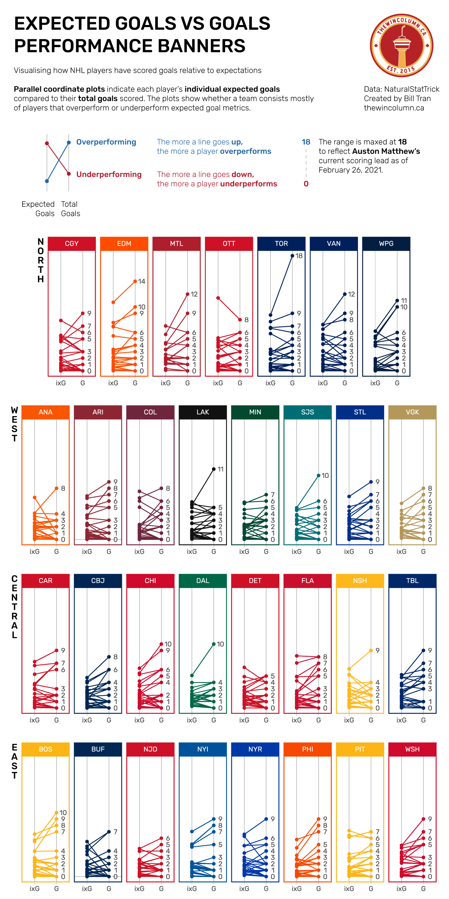
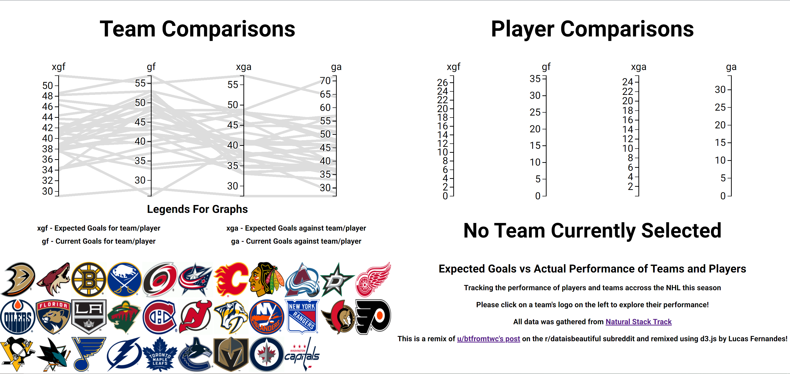
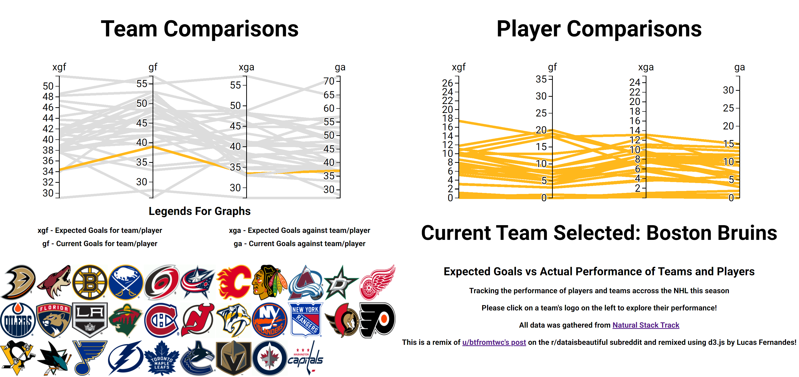

Assignment 4 - DataVis Remix + Multiple Views
===

The primary aim of this assignment is to showcase your **individual** skills at critiquing, redesigning, and extending visualizations on the web.
Project Link: (http://lucasfernandes.dev/04-Remix/)

# A critique on the Orginal Visualization
I originally found this viualization as apart of my week 4 reflection. [Found on the r/dataisbeuatiful subreddit](https://www.reddit.com/r/dataisbeautiful/comments/ltr34n/oc_visualising_how_nhl_players_have_performed_in/), a user posted a vis showcasing the expected goals versus the current made goals of each player in the NHL. 

I really enjoy the unique usage of parallel coordninate graphs to indiviually inspect each NHL team's players performance to showcase outliers. But where I felt the project was lacking and could be improved was the showcasing the differences in teams based on performance. In the orignal vis teams were organized by their conference(region). I felt that comparing all teams side by side would showcase the performance need by players for a team to succeed in the NHL.

# My Remix Vis 
Focusing on comparing team performance to their players [I created](http://lucasfernandes.dev/04-Remix/) a link visualization that allows users to click on the logo of any team in the NHL and have their path on each graph colorized based on the team's primary color as well as greying out the rest of the data. When selecting the team the visualization will responsively notify which team is currently selected by the user. All data included was grabbed from the current season statistics from [Natural Stat Trick](http://www.naturalstattrick.com/) which is the same source as the original vis.
Below is a screenshot of the visualization on startup. 
And below this is a screenshot of the visualization after the user selects the Boston Bruins by clicking on the team's logo. 
## Reflecting On My Project 
After completing this project I am proud of what I was able to accomplish and the techincal hurdles I overcame but I alawys think there is room for improvement. The biggest issue I grappled with was the interaction and display of the data. While this was the problem to solve with this assignment I believe further improvement could be done to my visualization to optimize it for more in-depth comparisons between teams. Being able to select and compare teams I feel would be more beneficial given more time to scale the project.
# Project Achivements
Below are the design and technical achivements I completed during this project
## Design Achivements
* Used contrasting colors to ensure every selected team is discernable
* Used the hex color coding for each team's primary color in their respecitve logos
* Used team's logos as buttons to interact and link both views
* Used Roboto font family from Google Fonts to create consist font design
* Used Flexbox and viewport values to optimize site for responsive design(unfortunately not the graph...)
## Technical Achivements
* Using event listeners on team logos to handling user interactions with the visualizations
* Did data trimming to group player data by team and have a consistent team attribute for both data sets
# References
* [original visualization](https://www.reddit.com/r/dataisbeautiful/comments/ltr34n/oc_visualising_how_nhl_players_have_performed_in/)
* [Understanding basic implementation of parallel coordinate graphs](https://www.d3-graph-gallery.com/graph/parallel_custom.html)
* [Similar reference for parallel coordinate graph examples](https://bl.ocks.org/jasondavies/1341281)
