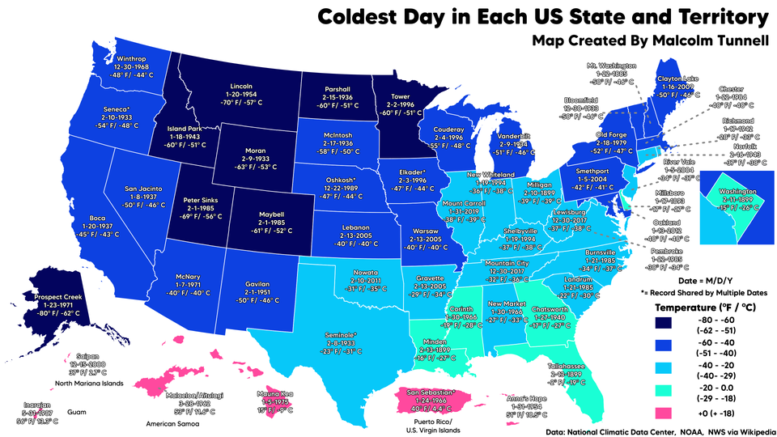
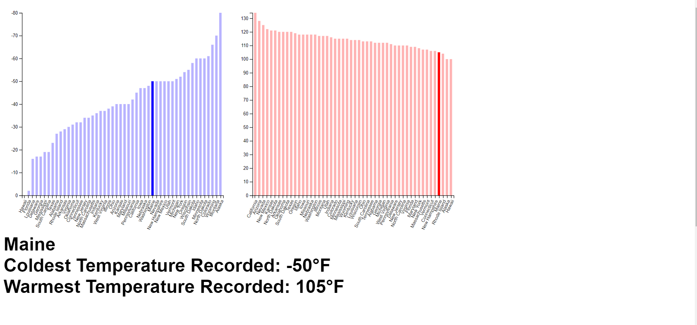

Assignment 4 - DataVis Remix + Multiple Views
===

Colby Frechette
===

For this assignment I was tasked with choosing a data visualization and "remixing" it as well as creating two data visualizations that have linked interactivity. 

I chose this [graph](https://www.reddit.com/r/dataisbeautiful/comments/lx9pbm/oc_the_coldest_day_in_each_us_state_and_territory/) - Credit to Reddit User [malxredleader](https://www.reddit.com/user/malxredleader/) which was a choropleth map (Figure 1) that depicted the coldest days recorded in each U.S. State. I decided to remake the graph in order to better show the quantitative difference between the values as the spectrum of blue colors can be hard to distinguish when clumped into categories. I arranged the values on a bar chart with axes to show the values in comparison to each other with a hover functionality that displays the state and information below. I also added a linked view of the warmest days recorded in each U.S. state to give more context to the user. When a state is hovered on in one graph, the same state is highlighted in the other graph with the information displayed below both. (Figure 2) My data was taken from the same source as the original Reddit post, the [NOAA](https://www.ncdc.noaa.gov/extremes/scec/records)

(Figure 1)

(Figure 2)

Design and Technical Achievements
===

Design Achievements: I chose to display both values so that they are easier to actually determine what the values are for the user as well as the state name that is hovered over. I also chose an equal ratio for the saturation of a Hue Saturation Value color for each graph (e.g. hovered = 100% saturation, unhovered = 30% saturation, for both the red and blue.) I chose to do this after doing some research as to how people perceive hover  better and what colors to choose. I also would consider this vis as a design achievement over the original vis, as it's metric of comparison was awful (shades of blue) where mine is quantitative. I also rotated the text for both graphs in order to make the text easier to read on the X axis, as horizontal text would not have fit and vertical text is hard to read.

Technical Achievements: I sorted the data by temperature lowest to highest and highest to lowest, respectively for each graph to better help user compare the data. I also removed some information that was not a U.S. State from my dataset, such as Puerto Rico and the Virgin Islands.
