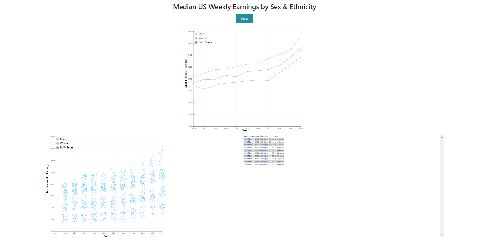
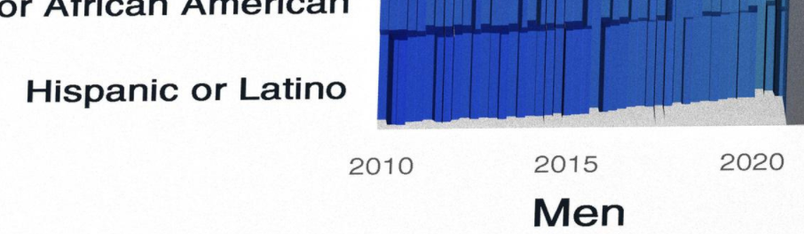

Assignment 4 - DataVis Remix + Multiple Views - Roman Wicky van Doyer
===

Link
---
https://romanwicky.github.io/04-Remix/index.html

Description
---
For this project, I found an original VIS on r/dataisbeautiful that shows the average median income (by week) in the United States by Sex and Ethnicity.
For my remix, I decided to create an interactive linked-vis with a scatter plot, and multi-line graph in D3.
The legend is the interactivity part of the vis, where selecting a sex (Men, Women, Both Sexes) in either graphs
hides all other data points not of that type.

Screenshots
---
- All of these screenshots are zoomed out to show the whole vis.

Selecting one value on legend updates the focus on the other graph
---

Original Vis Critique
---

This VIS uses a 3D bargraph with a colormap showing the median weekly earnings. This graph was separated between Men and Women.
There are a couple issues with this graph:
- The 3D bar graph makes it hard to distinguish the different median weekly earnings in between races
- The ColorMap makes it impossible to know values of median weekly income
- Blurring between different bar-graphs can make it hard to distinguish 
Shown here:
  

Design Achievements
---
- Added a mouseover and mouseout on the scatterplot to make the radius of the selected dot larger
- Added a legend to represent each dot color with sex
- Made it so the line-graphs become gray when not selected, allowing for users to compare the selected line graph
- Button interaction: reset graph button resets the focus to all data points
- Learned how to make a grid background for graphs
- Color scheme to separate the different dots in the scatterplot - corresponding with the colors on the line graph

Technical Achievements
---
- CSS styling for the button
- Added a mouseover and mouseout on the scatterplot to make the radius of the selected dot larger
- Added a jitter value to the scatterplot to spread out the values, makes the easier to distinguish
- Figured out how to make a multi-line graph with different lines for each sex. This also helped with easy filtering as I assigned an ID to each line.
- Added a D3.brush components, which creates a table of all the selected circles showing Year, Sex, Income, Ethnic Background, and Age

Sources from Original Vis
---
- https://github.com/berthubert/bnt162b2
- https://www.reddit.com/r/dataisbeautiful/comments/luz3es/median_us_weekly_earnings_by_sex_raceethnicity/
- https://www.reddit.com/r/dataisbeautiful/comments/luz3es/median_us_weekly_earnings_by_sex_raceethnicity/gp9ignx/

Sources
---
- https://www.d3-graph-gallery.com/graph/line_several_group.html
- https://www.d3-graph-gallery.com/graph/scatter_basic.html
- https://www.d3-graph-gallery.com/graph/violin_jitter.html
- https://bl.ocks.org/d3noob/c506ac45617cf9ed39337f99f8511218
- http://bl.ocks.org/feyderm/6bdbc74236c27a843db633981ad22c1b

