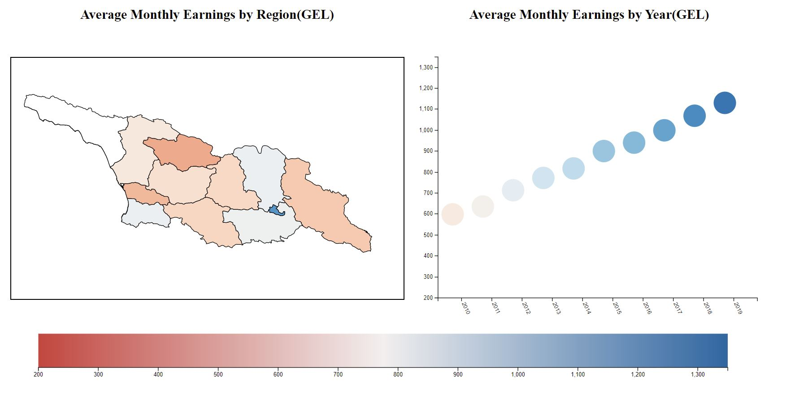

Assignment 4 - DataVis Remix + Multiple Views
===

Author: Elene Kavtaradze

Github Pages: https://ekavtaradze.github.io/04-Remix/

### Original Vis

The original visualization is from GeoStat, National Statistics of Georgia. I decided to focus on the Wages Statistics. All of the visualizations provided are simple connected scatter graphs. All of the visualizations seem to lack
the dimensions mentioned in the titles.
For example, looking at "Average monthly nominal earnings of employees by economic activity" only showed the average
monthly earnings by year, but there is no breakdown by economic activity. "Average monthly nominal earnings of employees by economic activity and sex" has different lines for males and females. The lines for females and males are different colors and have different shaped encodings(diamond for men, circle for women). The However, it has no information about the economic activity. All of the information not included in graphs can be found in the attached files.

Even the main visualization of average nominal monthly earnings by year is not good. Instead of a proper visualization, the website has a table of the information.

### Process of Requirements

I decided to take one of the included files, "Average monthly nominal earnings by regions" to draw a map of Georgia to show the breakdown of monthly earnings by regions. I linked that visualization with a graph for average monthly earnings by year. I focused on the years 2010-2019. I reworked the original dataset (data\13_Earnings-by-regions_annual.xlsx) to make it easier to fetch with js (data\earningsRegions.csv).

Original dataset

The modified dataset

I used a geojson file specific to Georgia to include all the regions and their names. I modified the name of one of the regions from Ajaria to Adjara for correctness.

Hovering over different regions on the map adjusts the bar graph to show the average monthly earnings of that regions.

Hovering over the bars of different years adjusts the map to the earnings of that year.

#### Technical Achievements

- Hovering over different regions shows the name of the region
- Hovering over different years shows the year
- The map included a color scale legend
- Map has zoom functionality
- Hovering over a region updates the heading of the graph

### Design Achievements
- The map uses a simple colors
- Clicking on a region freezes the bar graph on the data of that region (until un-click)
- Added borders to the map to make it cohesive
- Added a legend for the wage scale

### Resources used

#### Data

- Earning Stats: https://www.geostat.ge/en/modules/categories/39/wages
  - Used "Average monthly nominal earnings by regions"
- Geojson for Georgia: https://github.com/bumbeishvili/geojson-georgian-regions - Changed Region Name Ajaria to Adjara

#### Technical

- Brushing and Linking example: https://bl.ocks.org/john-guerra/2c00b2d675a6bf1c84a7b140f4536b0d
  - Started with a bar chart, then converted it to a scatter graph
- Hover Tool Guide: https://medium.com/@kj_schmidt/show-data-on-mouse-over-with-d3-js-3bf598ff8fc2
- Color schemes: https://github.com/d3/d3-scale-chromatic
- Legend: https://bl.ocks.org/wboykinm/dbbe50d1023f90d4e241712395c27fb3
