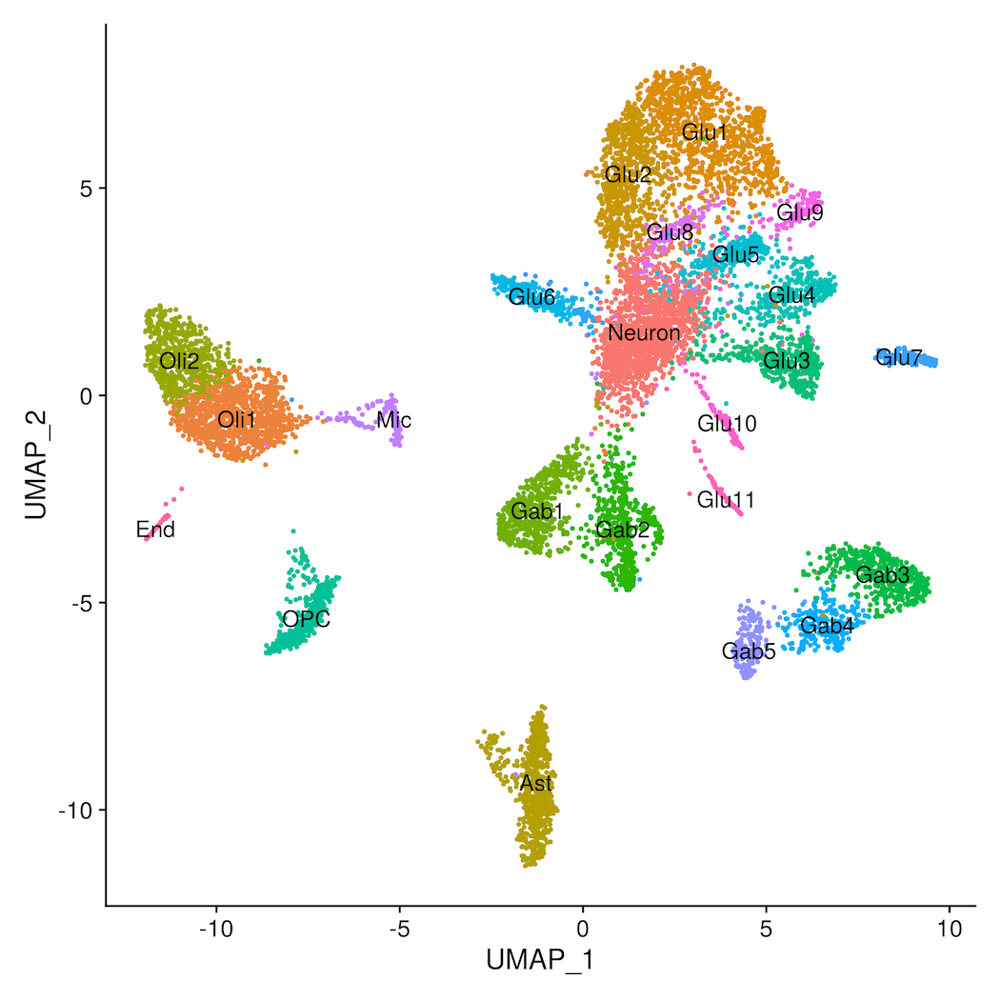

Assignment 4 - DataVis Remix + Multiple Views
===

The primary aim of this assignment is to showcase your **individual** skills at critiquing, redesigning, and extending visualizations on the web.

## Vis to Remix

Link to visualization:
https://nshedd.github.io/04-Remix/index.html

I wanted to remix a UMAP visualization that I created in ggplot.

This data is from Lake et al., 2018 and is single-nucleus RNA-seq data from the frontal cortex of the brain. It is publically available and can be dowloaded in Fasta format from their publication, or pre-processed from Geo.
I uploaded the code that I used for data analysis. I did not upload the original data file, as it is large and sparse. In the data analysis file, I included code for writing the embedding and expression csvs that I used to generate the plots

{ width=50% }

One thing that I don't like about this vis is the color. I find ggplot's default colors difficult to differentiate after 10 clusters. Some of the clusters are difficult to tell the difference between. This plot had 22 clusters that required different colors. I used colorgorical to generate a 22-element color palette with the highest perceptual difference possible.

I also wanted to add an element where you can clearly see information about the expression data driving the embedding. UMAPs are very interesting and create clusters based on expression profile, but you cannot glean any specific infomration about that profile from the plot itself.

I added to the UMAP plot a bar chart that takes the average of expression profiles for marker genes associated with a particular cell type. On hover over a point, the average expression profile for that cell's cluster is displayed on the bar chart. The above image shows a hover over a cell that appears to be an excitatory neuron cluster. It also maintains the color of the cluster, but grays out all of the other cells.

I chose not to include a barplot-to-scatterplot interaction, because I didn't think that it would be informative based on the visualization that I planned.

### Technical achievments:
  - Advanced data processing to obtain UMAP plot coordinates and scaled gene expression information
  - Linked visualizations pulling from 2 unique csv files
  - Values of the barplot change based on the mouseover

### Design achievments:
  - Added mouseover and mouseout events to make clusters easier to disinguish
