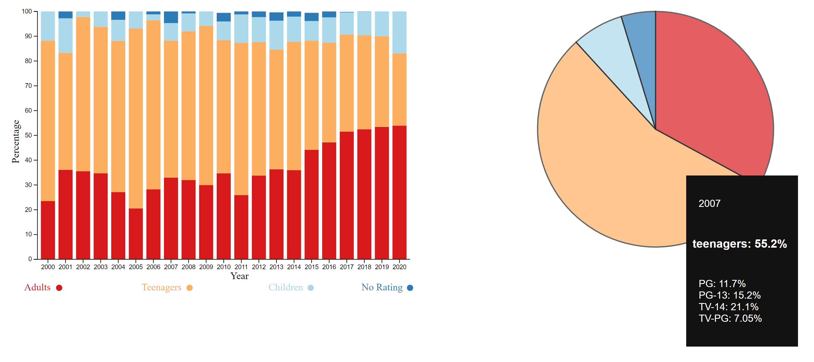

# Assignment 4 - Total Piece Travel Over Grandmaster Magnus Carlsen's Chess Career

CS480X Assignment 4
Nicholas Alescio

Project Page: https://alescion.github.io/04-Remix/

# Background
---
As a Chess enthusiast myself, I was interested to stumble upon this visualization on Reddit's r/dataisbeautiful:

The dataset used for this visualization is 'chess_distance.csv'. I downloaded it off a link included in the Reddit post by OP.

I think the principal issue with this visualization is that it leaves a lot for the user to extrapolate. Without being knowledgeable of chess theory, it's difficult to understand the significance of any of the data here (for example, why does Magnus move his king more when playing with the white pieces?). But as someone who has some amateur knowledge of chess theory, there are a lot of interesting things that can be extrapolated here. For example, the fact that Grandmaster (GM) Magnus Carlsen moves his f, g, and h pawns the least out of all the other pawns could indicate that he tends to castle kingside in most of his games, and as such does not want to weaken his king position by moving those kingside pawns. Also notable here is the fact that he moves his king more as the white pieces, pointing towards his notable endgame abilities. Magnus is known to consistently convert winning positions with the white pieces into endgames (where many pieces are traded and few are left).

# The Remix Plan
---
I decided to remix this visualization. My original plan was to change the units to 'squares' traveled, as opposed to meters (not all chess boards have the same size squares), and to add an interactive component. The interactive component would allow the user to select a bar on the main bar chart and "filter" the data by the selected piece. Part of this meant adding a y-axis label for each piece as opposed to white/black pairs. Selecting a bar would, in theory, update another graphic such as a pie chart or a gauge with the win percentage for the games where Magnus frequently moved that piece (at least 4 squares in the game). This was possible given that the dataset used in the original graphic contained the last ~3000 games of Magnus's chess career, with each game containing the number of squares that each of Magnus's piece moved.

# The Results
---

So... it didn't turn out the way I originally intended. Attempts to create a pie chart/gauge were futile, even with the assistance of my A3/final project partners. Many hours of my day were spent getting the bar chart to work (the first iteration was a mystery failure - the TA (Noëlle), and I could not figure out what the issue was). What the current visualization does is it allows the user to select a bar and get statistics for the corresponding piece (win, loss, and draw percentage for games where that piece was frequently moved).

### Technical Achievements Attempted
- wrote a Python script to extrapolate from the original dataset (chess_distance.csv) and get the total travel distance for each piece (see distances.csv).
- selecting all games in the dataset based on the specified piece and filtering games where that piece moved >= 4 times
- selecting bars updates pie/donut chart or gauge with win percentage (failed)

### Design Achievements Attempted
- created bars for each individual piece
- used a standard unit of measurement for distance traveled
- included chess unicode characters
- some CSS styling to make the statistics div appear alongside the bar chart

# References
---
Original reddit post: https://www.reddit.com/r/dataisbeautiful/comments/lje2s4/total_distance_traveled_by_gm_magnus_carlsens/

Link directly to viz: https://i.redd.it/2mtubvj7hch61.png

Source: http://www.pgnmentor.com/files.html

Viz data: https://drive.google.com/file/d/1t7PZEkSu2Tz68LymGptMDIwmMETBy0Lk/view?usp=sharing
