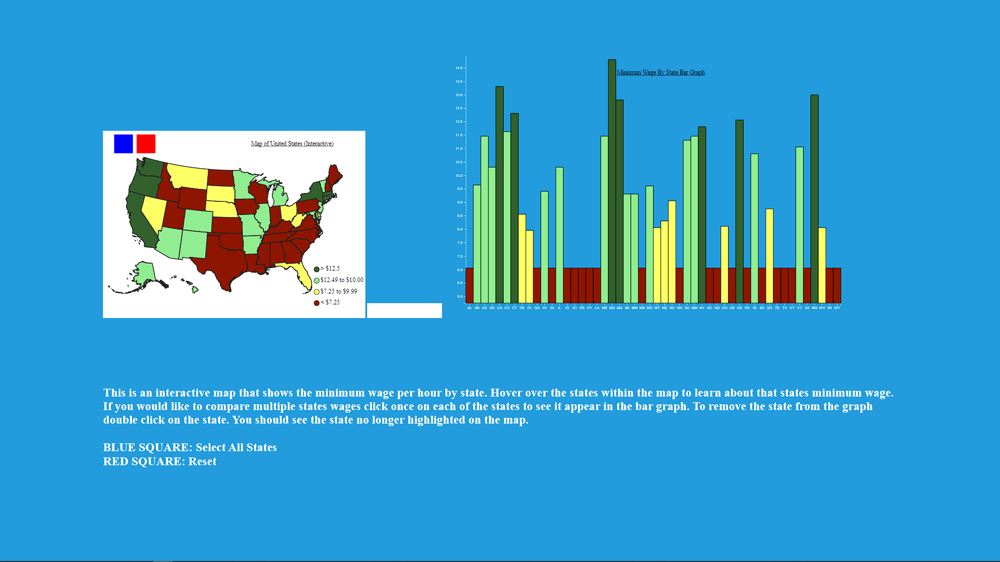

# Assignment 4: Data Remix

## Github Pages Link
https://ashpai24.github.io/04-Remix/

## Critiqued Data Visualization

### This visualization is a map of the minimum wage across the United States.
#### Pro: I like the color coordination between wages (color corresponding to a wage)
#### Pro: I like that each circle, or state, has a wage displayed directly on it making it easy to read. 
#### Cons: I don't like that the states geospatial location are not in the correct spot, it makes it difficult to compare how the wage changes depending on where you are in the country. 
#### Cons: It can be hard to compare the wages between states that are far apart. (i.e Cali and Delaware are far apart)

### My Improvements
##### 1. Created an interactive map that allows you to see how the location in the country affects the wage
##### 2. Created a bar chart that allows you to compare the states on a bar graph to see how wages in states compare against each other

## My Visualization 

## Description: This is a interactive map and bar chart that describes the minimum wage required by each state. Instructions for how to use the map and bar graph can be found on the actual webpage. 

## Technical Achievements
### 1. Created an interactive map using geojson file - when you select a state it adds it to the bar graph allowing you to compare different states wages.
#### Maps were covered in class, but interactive maps were not covered which is why I have included it as a TA. 

## Design Achievements
### 1. On click, the state that is clicked will highlight making it easier to see in comparison to the non-selected states. 
### 2. The red and blue squares on the map will reset and select all the states. This prevents the user from needing to unclick or click all the states when comparing. 
### 3. A legend helps the user understand the colors on the map, this also corresponds to the bar graph. 