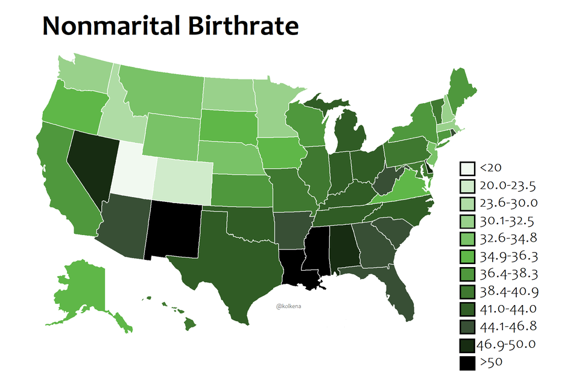

Assignment 4 - DataVis Remix + Multiple Views
===

Original:

Source unknown - it was sent to me by a friend, who found it on Twitter, but not from the original source. I tried finding it through reverse image search, but turned up nothing. I used the same image for my Week 3 reflection.

Preview:

Live Link: coming soon.

Preamble
---

There is a lot wrong with the original graph - enough to the point where I honestly have a lot of unpleasant dreams about it. As such, I sought to improve and expand upon many different aspects in hopes of restraining my brain from further tormenting itself.

One of the first things I fixed was the data samples. Instead of just a few select countries and data pulled from an unknown source (albeit most of the numbers in the original are more or less the same as mine), I used an article from November 2020 to pull data on every recognized country in the world. I also used measurements in metric rounded to the nearest whole number instead of imperial in order to be more exact.

Because there wasn't really a premade file with all the information I wanted and nothing extraneous, I ended up personally collecting all the information I needed in a csv. This proved frustrating but ultimately ended up necessary, because I am a stubborn old fool.

So then I came to the issue of having way too many data points to just put in a bar graph. I tried to make it work - I implemented a horizontal scroll, I redid the entire thing so it was vertical, and at the end of the day I realized it was not going to happen in an effective way. I really, really hated the idea of just picking about 5 per continent, but it was looking like it would be the best idea... and then I realized that chloropleth maps exist for a lot of reasons.

I scrapped everything I had and came to design number three: the chloropleth. I used a chloropleth reference (linked below) and modified it huge amounts to customize it for my needs. But that wasn't enough - no, we needed a tooltip to display the country name and the actual value of the average height. I struggled a lot with this and had to combine several guides online to get what I actually wanted and to make it work with my already-written code, jank as it is.

In my original reflection, I also noted that the "female"-shaped icons were misleading due to inappropriate scaling, and that bar graphs would be better. As such, I decided to make my second SVG a bar graph depicting only a few pieces of data based on user selection from the chloropleth. This second SVG fulfills the requirement of having two linked views for the data.

Features
---

On the chloropleth, hovering over a country displays its name and the exact average height in a tooltip. It also focuses the view on the country by increasing its opacity, decreasing others' opacity, and adding a black border. As soon as the mouse is moved away, the tooltip disappears, and the view returns to normal.

When a country is clicked on the chloropleth, its data is sent to pulled-data.csv. Clicking the "Refresh Bars" button redraws the bar graph with new data. (I strongly recommend not selecting more than three at a time...)

Tech & Design Achievements
---

I haven't previously worked with tooltips or chloropleths. As such, making either of them work was a pretty big achievement for me, not to mention making them work together. I heavily referenced online resources for both (listed below in section Sources), but ultimately ended up writing a ton of my own code to get it all to function exactly how I wanted. As much as d3 commands still sort of feel like a mysterious blob, I definitely have a strong grasp on its overall workings now.

Getting the data-pulling and SVG refresh to work was also kind of a nightmare, and I'm not actually 100% certain my method is actually reliable, but it works.

Also, I'd like to think I did pretty well with the CSS, color scheme, and overall layout of the entire project. It's both consistent and readable, and I think it's pretty visually appealing while also being meaningful.

Sources
---

Chloropleth reference: https://www.d3-graph-gallery.com/graph/choropleth_hover_effect.html
Tooltip reference: https://bl.ocks.org/mbostock/1087001
Height data: https://www.thelancet.com/journals/lancet/article/PIIS0140-6736(20)31859-6/fulltext
Country codes: https://www.iban.com/country-codes
