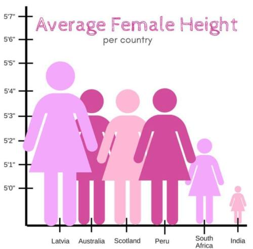

Assignment 4 - DataVis Remix + Multiple Views
===

Original:

*Source unknown - it was sent to me by a friend, who found it on Twitter, but not from the original source. I tried finding it through reverse image search, but turned up nothing.

Live Link: coming soon.

Preamble
---

(This visualization was from my Week 3 Reflection!)

There is a lot wrong with the original graph - enough to the point where I honestly have a lot of unpleasant dreams about it. As such, I sought to improve and expand upon many different aspects in hopes of restraining my brain from further tormenting itself.

One of the first things I fixed was the data samples. Instead of just a few select countries and data pulled from an unknown source (albeit most of the numbers in the original are more or less the same as mine), I used an article from November 2020 to pull data on every recognized country in the world. I also used measurements in metric rounded to the nearest whole number instead of imperial in order to be more exact.

Because there wasn't really a premade file with all the information I wanted and nothing extraneous, I ended up personally collecting all the information I needed in a csv. This proved frustrating but ultimately ended up necessary, because I am a stubborn old fool.

So then I came to the issue of having way too many data points to just put in a bar graph. I tried to make it work - I implemented a horizontal scroll, I redid the entire thing so it was vertical, and at the end of the day I realized it was not going to happen in an effective way. I really, really hated the idea of just picking about 5 per continent, but it was looking like it would be the best idea... and then I realized that chloropleth maps exist for a lot of reasons.

I scrapped everything I had and came to design number three: the chloropleth. I used a chloropleth reference (linked below) and modified it huge amounts to customize it for my needs. But that wasn't enough - no, we needed a tooltip to display the country name and the actual value of the average height. I struggled a lot with this and had to combine several guides online to get what I actually wanted and to make it work with my already-written code, jank as it is.

In my original reflection, I also noted that the "female"-shaped icons were misleading due to inappropriate scaling, and that bar graphs would be better. However, upon further thought, I realized that the "female"-shaped icons were actually not inherently wrong; rather, the problem was in the axes. The icons actually work quite well to help the viewer properly visualize height differences, so I created my own to use in the comparison on the right half of the screen. //TODO FINISH THIS

Sources
---

Chloropleth reference: https://www.d3-graph-gallery.com/graph/choropleth_hover_effect.html
Height data: https://www.thelancet.com/journals/lancet/article/PIIS0140-6736(20)31859-6/fulltext
Country codes: https://www.iban.com/country-codes
