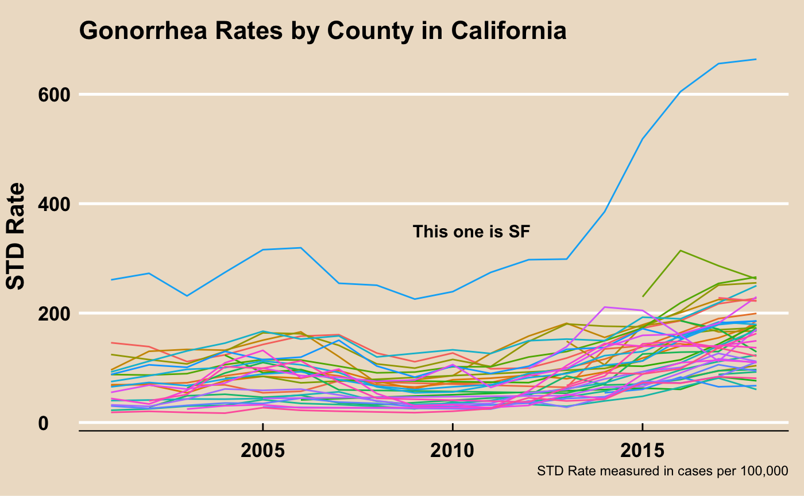
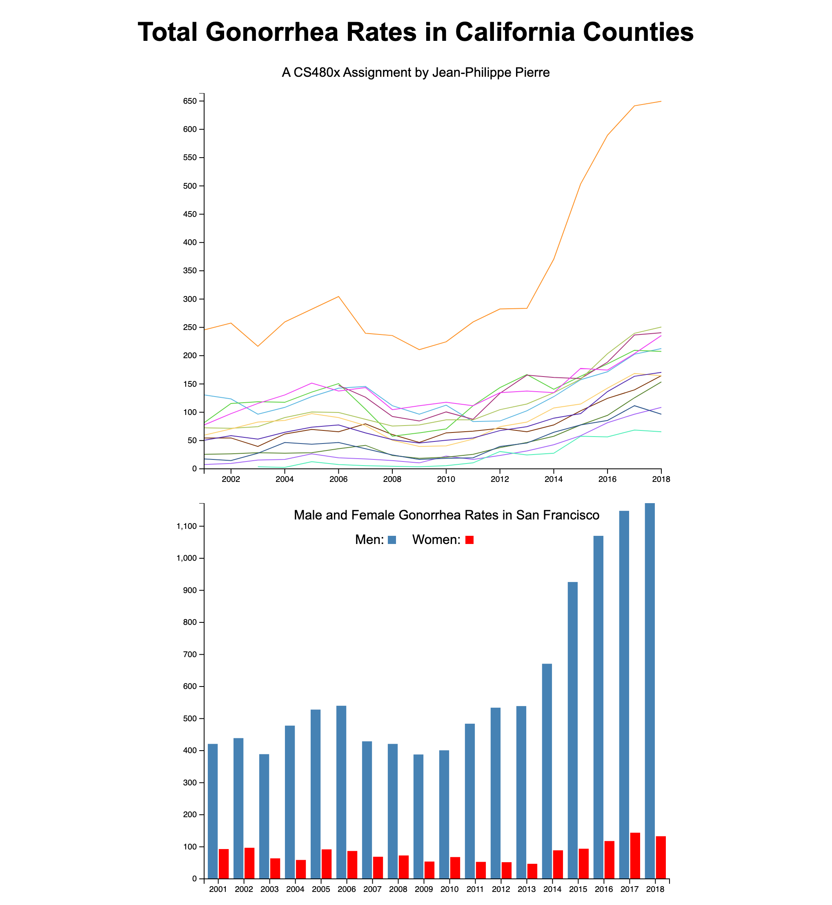

# Assignment 4

The original visualization:

The remix:

The dataset for this visualization can be found at https://data.world/chhs/4de76cd0-0ac9-4260-8ac3-0637acb444fb/workspace/file?filename=stds-by-disease-county-year-and-sex.csv. It is also in this repository, filtered to include only gonorrhea rates.

The original visualization was a line chart displaying the gonorrhea rates by California county over time. A major issue with the original vis was that it displayed numerous counties. This resulted in an excessive number of lines in the visualization, creating a lot of visual clutter. In addition, some of the colors of these lines are quite close to each other. Because they aren't very perceptually separable, the line chart is difficult to read. Finally, the line chart does not provide the user with the ability to check which county a specific line represents, apart from San Francisco.

The remix displays less lines and colors them so that they are as perceptually seperable as possible (Colors gained from Colorgorical). The original dataset contained rates not only total populations but for men and women as well. The remix displays these in a linked bar chart. Users can access each county's visualization of male and female rates by clicking on its corresponding line. The linked chart also displays the county name, letting users know the counties that correspond to each line.

Users can also hover over the bars in the linked bar chart to focus male or female rates in the chart.

Link to the remix visualization: https://japierreswe.github.io/04-Remix/

## Technical Achievements
* Animated the San Fransisco line to further convey the original vis's point.
* Created a tooltip for the lines on the line chart that displays the corresponding county's name.
* Added interactivity to the bar chart allowing users to focus the male rates or the female rates.

## Design Acheivements
* The mouse cursor becomes a pointer when hovering over the lines of the line chart to let the user know they can select the county. This was intended to improve the user experience.
* The stroke width of a line increases when a user hovers over to let the user know they can select the county. This was intended to improve the user experience.
* The tooltip feature was added to let the user know what county they are currently selecting. The title of the linked bar chart lets the user know what county has been selected. This was a design choice to help them to know what counties the lines in the line chart represent.
* The focus feature in the bar chart was intended to make it easier for users to view trends in the Male or Female group.
* Added a legend to linked bar chart.
* The focus feature of the bar chart focuses the corresponding line chart to make it easier for the user to know which line corresponds to the county.